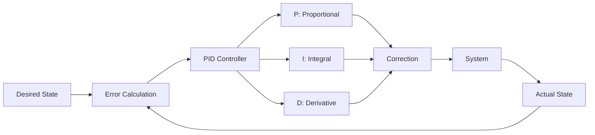
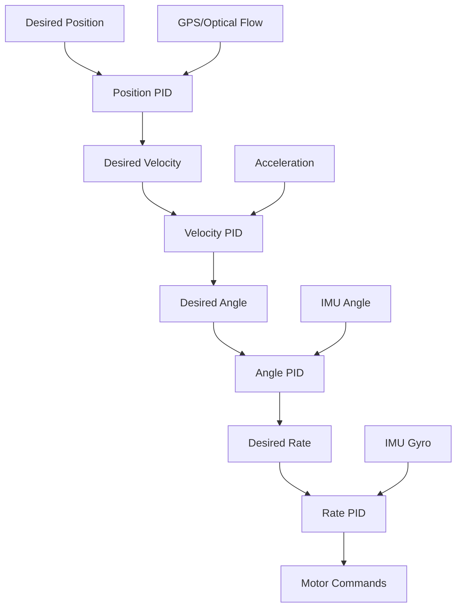

# Advanced Control Techniques

Advanced control techniques dive deep into the algorithms and theory that enable precise, stable flight. This page covers PID tuning, state estimation, path planning, and other topics for students ready to optimize performance.

## PID Control Fundamentals

### What is PID Control?

PID (Proportional-Integral-Derivative) is a control loop algorithm that continuously calculates an error value and applies corrections.



### PID Components

#### Proportional (P)
Responds proportionally to current error.

**Effect:**
- Larger error → Stronger correction
- Quick response
- Never quite reaches target (steady-state error)

**Formula:**
```
P_output = Kp × error
```

**Analogy:**
Pushing harder on steering wheel proportional to how far off-course you are.

#### Integral (I)
Accumulates error over time.

**Effect:**
- Eliminates steady-state error
- Can cause overshoot if too high
- Helps counter constant disturbances (wind)

**Formula:**
```
I_output = Ki × ∫(error)dt
```

**Analogy:**
Getting increasingly frustrated and making bigger corrections the longer you're off-target.

#### Derivative (D)
Responds to rate of change of error.

**Effect:**
- Dampens oscillations
- Anticipates future error
- Reduces overshoot
- Sensitive to noise

**Formula:**
```
D_output = Kd × d(error)/dt
```

**Analogy:**
Noticing you're approaching target quickly and easing off to avoid overshooting.

### Combined PID Output

```
PID_output = Kp×error + Ki×∫(error)dt + Kd×d(error)/dt
```

## PID in Multirotor Control

Multirotors typically use cascaded PID loops:



### Rate (Innermost Loop)
- Controls rotation rate (degrees/second)
- Fastest loop (~1000 Hz)
- Most critical for stability
- Directly commands motor speeds

### Angle (Stabilization Loop)
- Controls vehicle tilt (degrees)
- Moderate speed (~250-500 Hz)
- Provides self-leveling
- Commands rate loop

### Velocity Loop
- Controls speed (m/s)
- Slower (~50-100 Hz)
- Uses GPS or optical flow
- Commands angle loop

### Position Loop
- Controls location (lat/lon)
- Slowest (~10 Hz)
- Uses GPS
- Commands velocity loop

## PID Tuning Process

### Safety First

!!! danger "Tuning Safety"
    - Remove propellers for initial rate tuning
    - Start with conservative (low) values
    - Make small incremental changes
    - Have emergency stop ready
    - Tune in calm conditions
    - Test over soft ground
    - Have experienced pilot ready to take over

### Tools Needed

- Flight controller configurator (Betaflight, iNav, Mission Planner)
- Transmitter with tuning pots (optional but helpful)
- Logging enabled
- Analysis tools (PID Analyzer, log viewer)

### Step-by-Step Tuning (Rate PID)

#### 1. Start with Safe Defaults
Use community-tested baseline values for your frame size:

**5" Freestyle Quad:**
```
P: 45-55
I: 80-100
D: 35-45
```

#### 2. Tune P Gain
**Procedure:**
1. Start at baseline P value
2. Hover and make gentle stick inputs
3. Increase P if response is slow/mushy
4. Decrease P if oscillations occur
5. Optimal P is just below oscillation point

**Signs P is Too Low:**
- Sluggish response
- Drifts off course easily
- Doesn't track stick inputs well

**Signs P is Too High:**
- Fast oscillations (buzzing/vibrations)
- Hot motors
- Unstable hover

#### 3. Tune D Gain
**Procedure:**
1. With P set, start at baseline D
2. Increase D to dampen oscillations
3. Reduce D if getting motor noise/heat
4. Optimal D stops oscillations without excessive noise

**Signs D is Too Low:**
- Overshooting on stick release
- Bouncing at end of maneuvers
- Propwash oscillations

**Signs D is Too High:**
- Motors get hot quickly
- High-frequency noise
- Jittery hover
- Reduced battery life

#### 4. Tune I Gain
**Procedure:**
1. With P and D set, adjust I
2. Increase I to eliminate drift
3. Decrease I if slow oscillations occur
4. Optimal I maintains position under load

**Signs I is Too Low:**
- Steady drift in hover
- Doesn't fight wind well
- Sags under throttle changes

**Signs I is Too High:**
- Slow, large oscillations
- Excessive bounce-back
- Overshoot on direction changes

### Tuning for Different Applications

#### Racing
- High P: Quick response
- Moderate D: Some dampening
- Lower I: Less bounce-back
- Goal: Aggressive, responsive

#### Freestyle
- Balanced PID
- Smooth prop wash handling
- Good low-throttle control
- Goal: Controlled, smooth

#### Cinematic
- Lower P: Gentle response
- Higher D: Maximum smoothness
- Moderate I: Stable hover
- Goal: Smooth, stable footage

#### Education/Learning
- Conservative all gains
- Prioritize stability over performance
- Forgiving of pilot errors
- Goal: Safe, predictable behavior

### Rate Curves and Expo

**Expo (Exponential):**
Reduces sensitivity near center stick:

```
Output = Input^3 × Expo + Input × (1-Expo)
```

- 0% Expo: Linear response
- 30-40% Expo: Common, good balance
- 60%+ Expo: Very smooth center, hard edges

**Rates:**
Maximum rotation speed at full stick:

- Low (300°/s): Smooth, cinematic
- Medium (600°/s): Balanced
- High (900°/s): Racing, acrobatics

**Educational Setting:**
- Expo: 30%
- Rates: 400-500°/s
- Easier for beginners to control

## State Estimation and Filtering

### Sensor Fusion Challenge

Flight controllers combine multiple imperfect sensors:

- **IMU**: Accurate short-term, drifts long-term
- **GPS**: Accurate long-term, noisy short-term
- **Barometer**: Altitude but affected by weather
- **Compass**: Heading but affected by magnetic interference

### Extended Kalman Filter (EKF)

The EKF fuses sensor data to estimate vehicle state:

**States Estimated:**
- Position (X, Y, Z)
- Velocity (Vx, Vy, Vz)
- Attitude (roll, pitch, yaw)
- Sensor biases

**Process:**
1. **Predict**: Use motion model to predict next state
2. **Update**: Correct prediction with sensor measurements
3. **Fuse**: Weight each sensor by confidence/noise
4. **Output**: Best estimate of true state

**Advantages:**
- Handles sensor noise
- Accounts for sensor delays
- Continues through brief sensor outages
- Provides confidence estimates

### Complementary Filters

Simpler alternative to EKF:

```
filtered_angle = α × (previous_angle + gyro_rate × dt) + (1-α) × accelerometer_angle
```

- High-pass filter on gyro (good short-term)
- Low-pass filter on accelerometer (good long-term)
- α typically 0.98 (98% gyro, 2% accel)

**Advantages:**
- Computationally simple
- Real-time capable on any processor
- Stable and predictable

**Used For:**
- Angle estimation on simpler flight controllers
- Complementing primary EKF
- Educational demonstrations

### Tuning State Estimation

**ArduPilot EKF Parameters:**

```
EK3_ACC_P_NSE: Accelerometer noise (m/s²)
EK3_ACC_BIAS_LIM: Max accel bias (m/s²)
EK3_GYRO_P_NSE: Gyro noise (rad/s)
EK3_MAG_P_NSE: Magnetometer noise (Gauss)
```

**General Approach:**
- Start with defaults
- Increase noise if sensor too trusted (erratic behavior)
- Decrease noise if sensor not trusted enough (slow response)
- Check EKF innovation logs for health

!!! tip "When to Tune EKF"
    Most users should **not** tune EKF. Only adjust if:
    - Experiencing specific sensor fusion issues
    - Using non-standard sensors
    - Operating in unusual environments
    - Guided by log analysis from experienced developer

## Path Planning Algorithms

Path planning determines how to navigate from start to goal while avoiding obstacles.

### Grid-Based Planning

#### A* Algorithm

**How it Works:**
1. Discretize space into grid
2. Calculate cost: f(n) = g(n) + h(n)
   - g(n): Cost from start to node n
   - h(n): Estimated cost from n to goal (heuristic)
3. Expand lowest cost nodes first
4. Find optimal path if heuristic is admissible

**Advantages:**
- Optimal path if heuristic is admissible
- Complete (finds path if exists)
- Well-understood

**Disadvantages:**
- Memory intensive for large spaces
- Pre-requires grid map
- Replanning needed for dynamic obstacles

**Educational Implementation:**

```python
def heuristic(node, goal):
    # Manhattan distance
    return abs(node.x - goal.x) + abs(node.y - goal.y)

def a_star(start, goal, grid):
    open_set = PriorityQueue()
    open_set.put((0, start))
    came_from = {}
    g_score = {start: 0}

    while not open_set.empty():
        current = open_set.get()[1]

        if current == goal:
            return reconstruct_path(came_from, current)

        for neighbor in get_neighbors(current, grid):
            tentative_g = g_score[current] + cost(current, neighbor)

            if tentative_g < g_score.get(neighbor, float('inf')):
                came_from[neighbor] = current
                g_score[neighbor] = tentative_g
                f_score = tentative_g + heuristic(neighbor, goal)
                open_set.put((f_score, neighbor))

    return None  # No path found
```

### Sampling-Based Planning

#### RRT (Rapidly-exploring Random Tree)

**How it Works:**
1. Start with tree containing start position
2. Sample random point in space
3. Find nearest node in tree
4. Extend toward sample by fixed step size
5. If extension doesn't hit obstacle, add to tree
6. Repeat until goal reached or timeout

**Advantages:**
- Works in high-dimensional spaces
- Fast for complex environments
- Probabilistically complete

**Disadvantages:**
- Path not optimal (use RRT*)
- Can be jerky (needs smoothing)
- Non-deterministic

**Educational Implementation:**

```python
def rrt(start, goal, obstacles, max_iterations=1000):
    tree = {start: None}

    for _ in range(max_iterations):
        # Sample random point
        sample = random_point() if random() > 0.05 else goal

        # Find nearest node
        nearest = find_nearest(tree, sample)

        # Extend toward sample
        new_node = extend(nearest, sample, step_size=1.0)

        # Check collision
        if not collides(nearest, new_node, obstacles):
            tree[new_node] = nearest

            # Check if reached goal
            if distance(new_node, goal) < threshold:
                return extract_path(tree, new_node)

    return None
```

### Potential Fields

**Concept:**
- Goal exerts attractive force
- Obstacles exert repulsive forces
- Vehicle follows resultant force vector

**Forces:**
```python
def attractive_force(position, goal, gain=1.0):
    return gain * (goal - position)

def repulsive_force(position, obstacle, distance, threshold=5.0, gain=2.0):
    if distance > threshold:
        return Vector(0, 0)
    return gain * (1/distance - 1/threshold) * (1/distance²) * (position - obstacle)

def total_force(position, goal, obstacles):
    f_att = attractive_force(position, goal)
    f_rep = sum(repulsive_force(position, obs, dist(position, obs))
                for obs in obstacles)
    return f_att + f_rep
```

**Advantages:**
- Simple to implement
- Real-time capable
- Smooth paths

**Disadvantages:**
- Can get stuck in local minima
- Difficult to tune gains
- Not guaranteed to find path

### Path Smoothing

Raw paths from planners often need smoothing:

**Techniques:**

1. **Waypoint Reduction**: Remove unnecessary intermediate points
2. **Spline Fitting**: B-splines or Bezier curves through waypoints
3. **Gradient Descent**: Iteratively adjust path to minimize cost
4. **Elastic Bands**: Treat path as elastic, let it settle

**Educational Example:**

```python
def smooth_path(path, iterations=100, alpha=0.5):
    """Gradient descent path smoothing"""
    smoothed = path.copy()

    for _ in range(iterations):
        for i in range(1, len(smoothed) - 1):
            # Pull toward average of neighbors
            avg = (smoothed[i-1] + smoothed[i+1]) / 2
            smoothed[i] = smoothed[i] + alpha * (avg - smoothed[i])

    return smoothed
```

## Collision Avoidance

### Sense and Avoid

**Sensor Types:**

- **Lidar**: 360° scanning, long range (40m+)
- **Sonar**: Simple, short range (<5m)
- **Stereo Vision**: Passive, depth from images
- **Time-of-Flight**: Active, real-time depth

### Simple Avoidance Algorithm

```python
def avoid_obstacles(vehicle, sensors, goal):
    # Get distance measurements
    distances = {
        'front': sensors.front.distance,
        'left': sensors.left.distance,
        'right': sensors.right.distance,
    }

    # Find obstacles too close
    threshold = 2.0  # meters
    obstacles_close = {dir: dist for dir, dist in distances.items()
                      if dist < threshold}

    if not obstacles_close:
        # No obstacles, head toward goal
        return direction_to(vehicle.position, goal)
    else:
        # Avoid closest obstacle
        closest = min(obstacles_close, key=obstacles_close.get)

        if closest == 'front':
            # Turn toward more open side
            if distances['left'] > distances['right']:
                return 'turn_left'
            else:
                return 'turn_right'
        elif closest == 'left':
            return 'turn_right'
        else:  # right
            return 'turn_left'
```

## Model Predictive Control (MPC)

Advanced control technique that optimizes future trajectory:

**Concept:**
1. Predict future states over time horizon
2. Optimize control inputs to minimize cost function
3. Execute first control input
4. Repeat (receding horizon)

**Advantages:**
- Handles constraints (max speed, acceleration)
- Optimal trajectories
- Predictive capability

**Disadvantages:**
- Computationally intensive
- Requires accurate model
- Complex implementation

**Educational Use:**
- Advanced robotics courses
- Simulation projects
- Research applications

## Advanced Topics

### Adaptive Control
System adjusts controller parameters based on performance:

- Recognizes when behavior changes (payload added, damage)
- Automatically tunes to maintain performance
- Used in high-end autopilots

### Neural Network Control
ML-based controllers trained on flight data:

- Can learn complex, non-linear behaviors
- Adapts to vehicle characteristics
- Active research area
- Requires extensive training data

### Swarm Control
Coordinating multiple vehicles:

- Flocking behaviors
- Formation flight
- Distributed task allocation
- Emergent intelligence

## Learning Activities

### Activity 1: PID Simulation
**Duration:** 2 hours
**Objectives:** Understand PID components through simulation
**Materials:** Python/MATLAB, simple simulator

1. Implement basic PID controller
2. Simulate simple system (drone altitude)
3. Tune P, I, D independently
4. Observe effect on response
5. Plot step response, error over time
6. Document optimal values

**Assessment:** Code correctness, understanding of each component, quality of tuning

### Activity 2: Rate PID Tuning
**Duration:** 2-3 hours over multiple sessions
**Objectives:** Safely tune real flight controller
**Materials:** Quadcopter, configurator, testing area

1. Record baseline PIDs
2. Bench test with props off
3. Tune P gain first
4. Add D dampening
5. Adjust I for drift
6. Test flight and refine
7. Document before/after performance

**Assessment:** Safety procedures, systematic approach, performance improvement

### Activity 3: Path Planning Implementation
**Duration:** 4-5 hours
**Objectives:** Implement and compare planning algorithms
**Materials:** Python, simulation environment

1. Create 2D environment with obstacles
2. Implement A* algorithm
3. Implement RRT algorithm
4. Compare paths, computation time
5. Add path smoothing
6. Visualize results

**Assessment:** Code correctness, comparative analysis, visualization quality

## Assessment Rubric

| Skill | Novice | Developing | Proficient | Expert |
|-------|--------|-----------|-----------|--------|
| PID Understanding | Can't explain components | Describes P, I, D | Explains interactions | Predicts tuning outcomes |
| Tuning Process | Random changes | Systematic but needs guidance | Independent methodical tuning | Optimizes for specific use case |
| Safety Awareness | Overlooks risks | Follows checklist | Anticipates problems | Identifies non-obvious risks |
| Algorithm Implementation | Can't modify examples | Implements with guidance | Independent implementation | Optimizes and extends |

## Troubleshooting

### Oscillations Won't Go Away
**Possible Causes:**

- P too high
- D too low
- Mechanical issues (bent prop, loose screws)
- Electrical noise
- Bad gyro

**Solutions:**

- Reduce P incrementally
- Increase D cautiously
- Inspect frame and props
- Check gyro mounting (soft mount)
- Enable filters carefully

### Hot Motors
**Possible Causes:**

- D gain too high
- Excessive vibrations
- Poor motor quality
- Over-propped (too large/pitch)

**Solutions:**

- Reduce D gain
- Balance propellers
- Soft-mount flight controller
- Use appropriate props for motors

### Drifts Despite Tuning
**Possible Causes:**

- I gain too low
- IMU not level-calibrated
- Bent motor arms
- Uneven motor thrust
- Wind

**Solutions:**

- Increase I gain
- Re-calibrate IMU on level surface
- Check frame alignment
- Test motors individually
- Fly in calmer conditions

## Next Steps

- Apply tuning knowledge to your [Build Guides](../uav-systems/build-guides/educational-quadcopter-build.md)
- Use advanced control for [Autonomous Projects](../curriculum-integration/project-based-units/autonomous-delivery.md)
- Troubleshoot issues using [Flight Operation Problems](../troubleshooting/flight-operation-issues.md)

## Additional Resources

- **Betaflight Wiki**: Comprehensive PID tuning guide
- **ArduPilot Tuning Guide**: Parameter explanations and procedures
- **Joshua Bardwell PID Tuning Videos**: Excellent visual explanations
- **Control Systems Engineering (Nise)**: Textbook for deeper theory
- **Modern Control Engineering (Ogata)**: Advanced control concepts
- **PID Without a PhD**: Accessible introduction to PID theory
