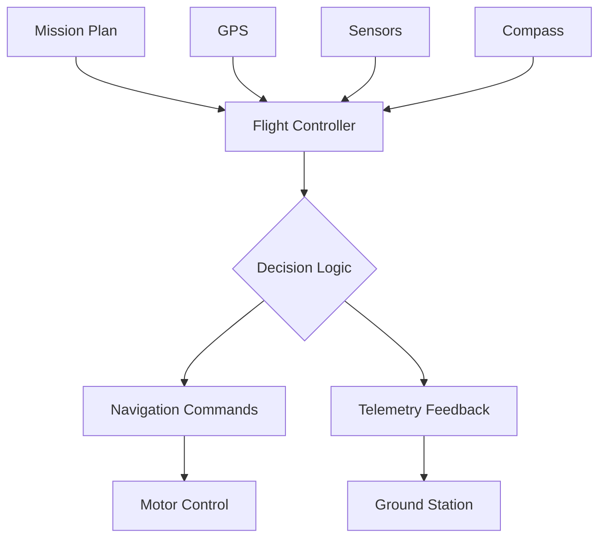
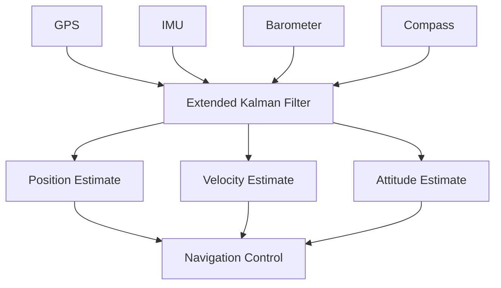

# Autonomous Control Systems

Autonomous control enables unmanned vehicles to operate with minimal human intervention, following pre-programmed missions or responding to sensor inputs. This page covers waypoint navigation, sensor-based autonomy, and mission planning fundamentals.

## What is Autonomous Control?

Autonomous control systems allow vehicles to:

- Navigate to specific GPS coordinates
- Follow pre-planned routes
- Respond to environmental sensors
- Make decisions based on programmed logic
- Return home automatically in emergencies



## Levels of Autonomy

### Level 0: Manual Control
- Pilot controls all aspects
- No autonomous features
- Direct stick-to-motor mapping

### Level 1: Stabilization
- Vehicle self-levels
- Pilot still provides all directional input
- No position or altitude hold

### Level 2: Assisted Flight
- Altitude hold
- Position hold (loiter)
- Heading hold
- Pilot remains engaged

### Level 3: Semi-Autonomous
- Waypoint navigation with pilot supervision
- Return-to-launch on command
- Automated takeoff/landing with trigger
- Pilot can intervene anytime

### Level 4: Fully Autonomous
- Complete mission execution
- Obstacle avoidance
- Dynamic path planning
- Pilot as supervisor only

### Level 5: Swarm Intelligence
- Multi-vehicle coordination
- Emergent behavior
- Distributed decision-making
- Advanced research/commercial use

!!! tip "Educational Focus"
    Most educational programs focus on Levels 2-3, providing a balance between autonomous capability and maintaining student engagement with piloting skills.

## Waypoint Navigation

### How Waypoint Navigation Works

1. **Mission Planning**: Define waypoints on map
2. **Upload**: Transfer mission to vehicle
3. **Arm & Launch**: Initiate autonomous mode
4. **Execution**: Vehicle navigates between waypoints
5. **Completion**: Return to home or landing

### Waypoint Components

Each waypoint typically includes:

- **Latitude/Longitude**: GPS coordinates
- **Altitude**: Height above home or sea level
- **Speed**: Travel velocity
- **Heading**: Direction to face
- **Action**: Commands at waypoint (photo, delay, etc.)

### Mission Planning Software

#### Mission Planner (ArduPilot)
**Platform:** Windows, Linux (via Mono)
**Features:**

- Comprehensive flight planning
- Real-time telemetry
- Log analysis
- Parameter configuration
- Free and open-source

**Best For:** Advanced features, education, research

#### QGroundControl (Multi-platform)
**Platform:** Windows, Mac, Linux, Android, iOS
**Features:**

- Cross-platform
- Clean interface
- Works with PX4 and ArduPilot
- Mission planning and monitoring

**Best For:** Versatility, mobile devices

#### APM Planner 2 (ArduPilot)
**Platform:** Windows, Mac, Linux
**Features:**

- Lightweight alternative to Mission Planner
- Good for basic operations
- Simple interface

**Best For:** Basic missions, older computers

#### Litchi (DJI)
**Platform:** Android, iOS
**Features:**

- Mobile-friendly
- Waypoint missions for DJI drones
- Virtual reality mode
- Commercial license ($25)

**Best For:** DJI platforms, mobile mission planning

### Creating Your First Mission

#### Step-by-Step Process

**1. Pre-Mission Planning**
- [ ] Survey flight area physically
- [ ] Check for no-fly zones
- [ ] Verify GPS coordinates
- [ ] Calculate battery requirements
- [ ] Plan emergency landing zones

**2. Software Setup**
- [ ] Connect to ground station
- [ ] Download current parameters
- [ ] Set home location
- [ ] Configure failsafe actions

**3. Waypoint Creation**
```
Waypoint 1: Takeoff (auto)
  - Altitude: 10m
  - Delay: 2s

Waypoint 2: First survey point
  - Lat/Lon: [coordinates]
  - Altitude: 20m
  - Speed: 5 m/s

Waypoint 3: Second survey point
  - Lat/Lon: [coordinates]
  - Altitude: 20m
  - Camera trigger: Yes

Waypoint 4: Return point
  - Same as Waypoint 1
  - Land: Yes
```

**4. Mission Validation**
- [ ] Verify waypoints on satellite view
- [ ] Check altitude clearances
- [ ] Review estimated flight time
- [ ] Confirm battery capacity sufficient
- [ ] Upload and verify on vehicle

**5. Execution**
- [ ] Pre-flight check
- [ ] GPS lock (10+ satellites)
- [ ] Arm in AUTO mode
- [ ] Monitor throughout mission
- [ ] Be ready to take manual control

### Mission Commands

#### Common ArduPilot Commands

| Command | Function | Educational Use |
|---------|----------|-----------------|
| TAKEOFF | Auto takeoff to altitude | Start of missions |
| WAYPOINT | Navigate to coordinates | Basic navigation |
| LOITER_TIME | Hold position for duration | Observation, photo |
| DO_SET_SERVO | Trigger servo action | Payload release, camera |
| DO_DIGICAM_CONTROL | Trigger camera | Mapping missions |
| RETURN_TO_LAUNCH | Fly home and land | End of mission |
| LAND | Land at current position | Alternate endings |
| DO_JUMP | Repeat mission segment | Survey patterns |

### Mission Types for Education

#### Grid Survey Mission
**Objective:** Systematic area coverage
**Applications:** Mapping, search patterns, data collection

```
Pattern: Lawn mower / boustrophedon
Spacing: Based on camera FOV or sensor range
Overlap: 60-70% for mapping
Altitude: Determined by resolution needs
```

#### Perimeter Inspection
**Objective:** Follow boundary or structure
**Applications:** Infrastructure inspection, security

```
Waypoints: Along perimeter
Spacing: ~10-20m
Camera: Facing inward/outward
Speed: Slow for high-quality imagery
```

#### Point of Interest (POI)
**Objective:** Orbit around central point
**Applications:** 3D modeling, cinematography

```
Center: Target coordinates
Radius: Distance from target
Altitude: Varies for different angles
Heading: Always face center
```

#### Search Pattern
**Objective:** Locate target in area
**Applications:** Search and rescue, lost item recovery

```
Pattern: Expanding square or spiral
Altitude: Low for visual search
Speed: Slow enough to scan
Coverage: Complete overlap
```

## Sensor-Based Autonomy

### Sensor Types for Autonomy

#### GPS (Global Positioning System)
**Provides:**
- Latitude, longitude, altitude
- Velocity and heading
- Time synchronization

**Requirements:**
- 6+ satellites for 3D lock
- 10+ satellites for precise navigation
- Clear sky view
- Can take 30-60s for initial lock

**Limitations:**
- Accuracy: ±2-5m typical
- Indoor: Does not work
- Urban canyons: Reduced accuracy
- Interference: Possible jamming

#### Inertial Measurement Unit (IMU)
**Provides:**
- Acceleration (3-axis)
- Rotation rate (3-axis)
- Orientation estimation

**Used For:**
- Stabilization
- Dead reckoning
- Complementing GPS

#### Barometer
**Provides:**
- Atmospheric pressure
- Altitude estimation

**Used For:**
- Altitude hold
- Vertical velocity
- Terrain following

**Limitations:**
- Weather dependent
- Drift over time
- Requires calibration

#### Compass (Magnetometer)
**Provides:**
- Magnetic heading
- Orientation reference

**Used For:**
- Navigation bearing
- GPS-denied heading
- Waypoint approach

**Limitations:**
- Magnetic interference
- Requires calibration
- Indoor unreliable

#### Optical Flow
**Provides:**
- Velocity over ground
- Position hold without GPS

**Used For:**
- Indoor flight
- GPS-denied navigation
- Precision landing

**Requirements:**
- Textured surface
- Adequate lighting
- Rangefinder for altitude

#### Ultrasonic/Lidar Rangefinders
**Provides:**
- Distance to surface
- Precision altitude

**Used For:**
- Landing
- Terrain following
- Obstacle detection

**Range:**
- Ultrasonic: 0.5-5m
- Lidar: 0.1-40m+

### Sensor Fusion

Flight controllers combine multiple sensors for robust navigation:



**Benefits of Sensor Fusion:**

- Compensates for individual sensor weaknesses
- Improves accuracy through redundancy
- Enables operation during partial sensor failure
- Provides smooth, stable estimates

### Autonomous Behaviors

#### Return to Launch (RTL)
**Trigger Conditions:**

- RC signal loss
- Low battery
- Manual activation
- Geofence breach

**Behavior:**
1. Climb to RTL altitude (configurable)
2. Navigate directly to home position
3. Descend and land (or loiter)

**Configuration:**
```
RTL_ALT: 20m (altitude to climb to)
RTL_LOIT_TIME: 5s (loiter before land)
RTL_ALT_FINAL: 0m (final descent altitude)
```

#### Geofencing
**Purpose:** Define virtual boundaries

**Types:**
- **Cylindrical**: Radius and altitude limits from home
- **Polygon**: Custom shaped boundary
- **Altitude Only**: Maximum ceiling

**Actions on Breach:**
- RTL (most common)
- Hold position
- Land immediately

**Educational Application:**
```
Boundary: School property perimeter
Max Altitude: 50m AGL
Action: Return to launch
Purpose: Safety, legal compliance
```

#### Battery Failsafe
**Monitors:** Battery voltage and capacity remaining

**Actions:**
- **Warning Level** (e.g., 30%): Alert pilot, consider RTL
- **Critical Level** (e.g., 15%): Force RTL or land
- **Emergency** (e.g., 5%): Land immediately wherever possible

**Configuration Best Practices:**
- Conservative thresholds
- Account for RTL reserve (20-30%)
- Test with full mission profile
- Monitor voltage sag under load

#### Terrain Following
**Purpose:** Maintain constant height above ground

**Requires:**
- Rangefinder or terrain database
- Advanced flight controller
- Careful configuration

**Applications:**
- Contour mapping
- Low-altitude inspection
- Agricultural surveys

## Advanced Autonomous Features

### Computer Vision
**Applications:**

- Object detection and tracking
- Optical flow for positioning
- Visual servoing
- Landing pad recognition

**Hardware:**
- Companion computer (Raspberry Pi, Jetson Nano)
- Camera (USB or CSI)
- ArduPilot with UART connection

**Software:**
- OpenCV for image processing
- TensorFlow/PyTorch for AI
- ROS for robot integration
- Custom MAVLink commands

### Path Planning Algorithms

#### A* (A-Star)
- Grid-based pathfinding
- Optimal path with heuristics
- Good for known environments

#### RRT (Rapidly-Exploring Random Tree)
- Probabilistic path planning
- Good for complex obstacles
- Fast computation

#### Potential Fields
- Attractive force to goal
- Repulsive force from obstacles
- Simple to implement
- Can get stuck in local minima

**Educational Implementation:**
Start with simple algorithms in simulation before real-world deployment

### Obstacle Avoidance

**Sensor Options:**

- **Lidar**: 360° scanning, long range
- **Ultrasonic**: Simple, short range
- **Stereo Vision**: Depth perception
- **Time-of-Flight Cameras**: Real-time 3D

**Basic Implementation:**
```python
def avoid_obstacle(distance, threshold):
    if distance < threshold:
        stop_forward_motion()
        turn_away()
        resume_mission()
```

## Programming Autonomous Missions

### Mission Commands via MAVLink

Simple mission using DroneKit (Python):

```python
from dronekit import connect, VehicleMode, LocationGlobalRelative

# Connect to vehicle
vehicle = connect('/dev/ttyUSB0', wait_ready=True, baud=57600)

# Arm and takeoff
def arm_and_takeoff(target_altitude):
    vehicle.mode = VehicleMode("GUIDED")
    vehicle.armed = True
    vehicle.simple_takeoff(target_altitude)

# Navigate to waypoint
def goto_waypoint(lat, lon, alt):
    point = LocationGlobalRelative(lat, lon, alt)
    vehicle.simple_goto(point)

# Execute mission
arm_and_takeoff(10)
goto_waypoint(47.1234, -122.5678, 10)
# ... more waypoints
vehicle.mode = VehicleMode("RTL")
```

### Lua Scripting (ArduPilot)

Custom autonomous behavior:

```lua
-- Simple search pattern script

function update()
  local position = ahrs:get_position()
  if position then
    -- Implement search logic
    gcs:send_text(0, "Searching...")
  end
  return update, 100 -- Call again in 100ms
end

return update()
```

## Safety in Autonomous Operations

### Pre-Flight Safety Checklist

- [ ] Mission validated in simulator
- [ ] Waypoints verified on map
- [ ] Sufficient battery for mission + 30% reserve
- [ ] Geofence configured and tested
- [ ] Failsafes armed (RC loss, battery, GPS)
- [ ] Emergency procedures reviewed
- [ ] Communication with air traffic if required
- [ ] Observer assigned
- [ ] Abort plan established

### Autonomous-Specific Risks

1. **Software Bugs**: Thoroughly test in simulation
2. **GPS Spoofing**: Validate GPS health indicators
3. **Compass Interference**: Perform pre-flight compass check
4. **Waypoint Errors**: Double-check coordinates
5. **Battery Estimation**: Conservative planning
6. **Unexpected Obstacles**: Manual takeover readiness
7. **Communication Loss**: Reliable failsafes

!!! danger "Golden Rule of Autonomous Flight"
    The pilot must be able to immediately take manual control at any time during autonomous operations. Never operate beyond your ability to manually recover the vehicle.

## Learning Activities

### Activity 1: Mission Planning
**Duration:** 1 hour
**Objectives:** Create valid mission for specific objective
**Materials:** Ground station software, satellite map access

1. Choose objective (mapping, inspection, search)
2. Plan waypoint pattern
3. Calculate flight time and battery needs
4. Create mission in software
5. Peer review for safety

**Assessment:** Mission completeness, safety considerations, feasibility

### Activity 2: Simulator Autonomous Flight
**Duration:** 2 hours
**Objectives:** Execute autonomous mission in simulation
**Materials:** Flight simulator, mission file

1. Load pre-planned mission
2. Monitor simulated flight
3. Practice manual intervention
4. Experiment with failsafe triggers
5. Analyze logs

**Assessment:** Successful mission completion, appropriate interventions

### Activity 3: Basic Autonomous Mission
**Duration:** 30 minutes flight + prep
**Objectives:** Execute real autonomous mission
**Materials:** Complete UAV with GPS, ground station

1. Simple 3-4 waypoint mission in open area
2. Low altitude (5-10m)
3. Observer assigned
4. Execute mission
5. Debrief and log analysis

**Assessment:** Safety procedures, mission success, troubleshooting

## Assessment Rubric

| Skill | Novice | Developing | Proficient | Expert |
|-------|--------|-----------|-----------|--------|
| Mission Planning | Incomplete/unsafe | Basic mission with gaps | Complete safe mission | Optimized complex mission |
| Safety Procedures | Skips critical steps | Follows with reminders | Independent and thorough | Identifies additional risks |
| Parameter Tuning | Doesn't understand | Changes with guidance | Independent tuning | Optimizes for conditions |
| Problem Solving | Requires direct help | Researches with support | Troubleshoots independently | Helps others debug |

## Troubleshooting Autonomous Operations

### Vehicle Won't Arm in AUTO Mode
**Possible Causes:**

- Insufficient GPS lock (<6 satellites)
- Compass not calibrated
- Battery voltage too low
- Safety checks failing
- No mission loaded

**Solutions:**

- Wait for adequate GPS (10+ satellites ideal)
- Calibrate compass away from interference
- Charge/replace battery
- Check pre-arm failure messages
- Upload valid mission

### Mission Starts Then Immediately RTL
**Possible Causes:**

- Geofence too restrictive
- First waypoint outside fence
- Failsafe triggered immediately
- Invalid mission command

**Solutions:**

- Review geofence settings
- Validate waypoint coordinates
- Check battery/RC failsafe thresholds
- Review mission in planning software

### Vehicle Doesn't Follow Waypoints
**Possible Causes:**

- Wrong coordinate system (relative vs absolute)
- Poor GPS accuracy
- Wind exceeding vehicle capability
- Navigation parameters need tuning

**Solutions:**

- Verify altitude frame reference
- Wait for better GPS HDOP (<2.0)
- Increase navigation gains (with caution)
- Fly in calmer conditions

## Next Steps

- Learn [MAVLink Protocol](mavlink-protocol.md) for custom communication
- Explore [Advanced Control](advanced-control.md) for tuning and optimization
- Review [Troubleshooting](../troubleshooting/flight-operation-issues.md) for mission issues

## Additional Resources

- **ArduPilot Documentation**: Comprehensive autonomous flight guides
- **PX4 User Guide**: Alternative flight stack with excellent docs
- **DroneKit**: Python library for custom autonomous programming
- **QGroundControl User Guide**: Mission planning tutorials
- **MAVLink Developer Guide**: Protocol specifications and examples
