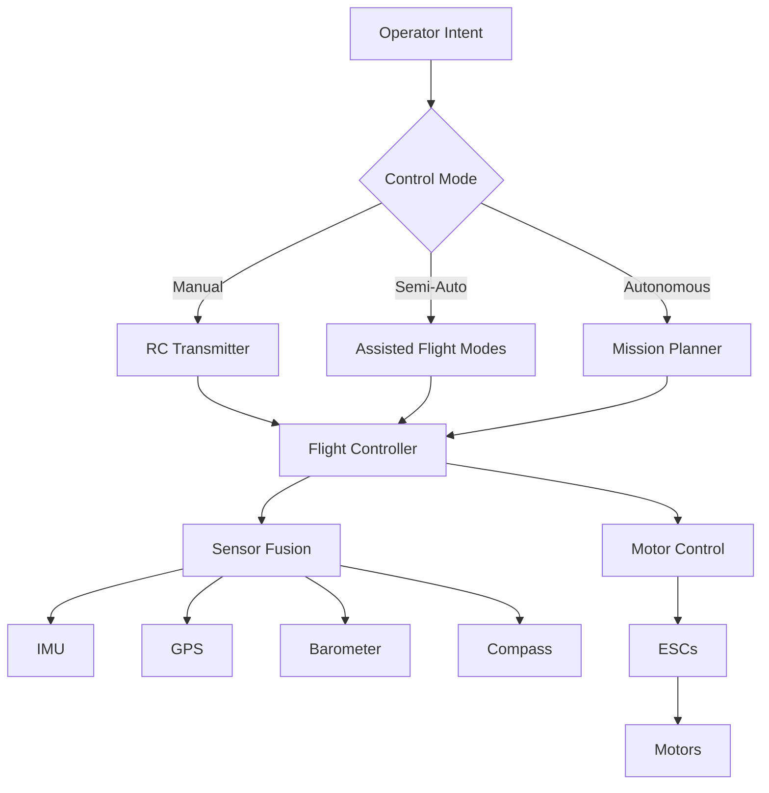

# Control Systems Overview

Understanding control systems is fundamental to operating and programming unmanned vehicles. This section covers the spectrum from manual radio control to fully autonomous operation.

## Control System Categories

### Manual Control
Traditional radio control using transmitter and receiver systems. The operator directly commands the vehicle in real-time.

**Key Topics:**

- RC transmitter operation and modes
- Flight modes and switch configurations
- Emergency procedures and failsafes
- Line-of-sight operation requirements

[Learn more about Manual Control →](manual-control.md)

### First-Person View (FPV) Systems
Enhanced manual control using real-time video feedback from onboard cameras.

**Key Topics:**

- Camera systems and mounting
- Video transmission frequencies and regulations
- FPV goggle operation
- Safety considerations for FPV flight

[Learn more about FPV Systems →](fpv-systems.md)

### Autonomous Control
Computer-controlled operation using sensors, GPS, and programmed missions.

**Key Topics:**

- Waypoint navigation
- Sensor-based autonomy
- Return-to-home and failsafe behaviors
- Mission planning software

[Learn more about Autonomous Control →](autonomous-control.md)

### MAVLink Protocol
The communication standard used for telemetry and command between ground stations and vehicles.

**Key Topics:**

- Protocol structure and message types
- Ground control station integration
- Companion computer communication
- Custom command implementation

[Learn more about MAVLink Protocol →](mavlink-protocol.md)

### Advanced Control Techniques
Deep dive into the algorithms and theory that make autonomous flight possible.

**Key Topics:**

- PID controller tuning
- State estimation and filtering
- Path planning algorithms
- Collision avoidance systems

[Learn more about Advanced Control →](advanced-control.md)

## Control System Hierarchy



## Learning Progression

### Level 1: Foundation (Weeks 1-4)
- RC transmitter basics
- Flight mode operation
- Safety procedures
- Line-of-sight manual flight

### Level 2: Enhanced Control (Weeks 5-8)
- FPV system setup
- Telemetry interpretation
- Assisted flight modes
- Basic mission planning

### Level 3: Autonomous Operations (Weeks 9-12)
- Waypoint navigation
- Sensor integration
- Custom mission scripting
- Advanced failsafe configuration

### Level 4: Advanced Techniques (Weeks 13-16)
- PID tuning methodology
- Custom MAVLink commands
- Path planning algorithms
- Multi-vehicle coordination

## Safety Considerations

All control systems must incorporate multiple layers of safety:

1. **Hardware Failsafes**: Physical kill switches and receiver failsafe settings
2. **Software Failsafes**: Return-to-home, geofencing, altitude limits
3. **Operational Procedures**: Pre-flight checks, range testing, emergency protocols
4. **Regulatory Compliance**: FAA Part 107 requirements, local restrictions

!!! warning "Critical Safety Rule"
    Always maintain the ability to immediately terminate flight through either:
    - Direct manual control override
    - Emergency kill switch
    - Automated failsafe triggers

    Never operate beyond visual line of sight without proper waivers and safety protocols.

## Educational Connections

Control systems integrate multiple STEM disciplines:

- **Physics**: Forces, motion, feedback loops
- **Mathematics**: PID algorithms, coordinate systems, trigonometry
- **Computer Science**: State machines, sensor fusion, path planning
- **Engineering**: System integration, testing, optimization

## Common Control System Architectures

### Educational Quadcopter
```
Transmitter → Receiver → Flight Controller → ESCs → Motors
                              ↓
                         USB/Telemetry
                              ↓
                      Computer (Configuration)
```

### Autonomous Rover
```
Mission Planner → MAVLink → Companion Computer → Flight Controller → Motor Controllers
                                                         ↓
                                                    Sensors (GPS, IMU, Lidar)
```

### Advanced UAV with Payload
```
Ground Station → Telemetry Radio → Flight Controller → ESCs → Motors
                                          ↓
                     Companion Computer (Vision, AI)
                                          ↓
                                   Payload Controller
```

## Assessment Opportunities

- **Knowledge**: Control system terminology and concepts
- **Skills**: Transmitter operation, mode switching, emergency procedures
- **Application**: Mission planning for specific objectives
- **Analysis**: Comparing control approaches for different scenarios
- **Creation**: Designing custom autonomous missions

## Next Steps

Begin with [Manual Control](manual-control.md) to establish foundational skills, then progress through each control method based on your project requirements and learning objectives.

## Additional Resources

- [Safety & Compliance](../safety-compliance/index.md) - Required reading before any flight operations
- [Flight Controllers](../uav-systems/flight-controllers/ardupilot.md) - Hardware platforms that implement these control systems
- [Troubleshooting](../troubleshooting/index.md) - Solving common control system issues
