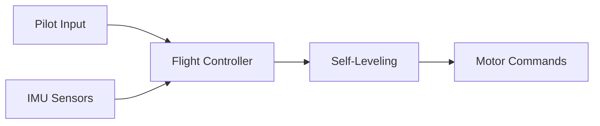

# Manual Control Systems

Manual control using radio control (RC) transmitters is the foundation of unmanned vehicle operation. This page covers RC basics, flight modes, and emergency procedures.

## RC Transmitter Basics

### Transmitter Components

**Control Sticks**

- **Right Stick**: Typically controls pitch and roll (Mode 2, most common in US)
- **Left Stick**: Typically controls throttle and yaw (Mode 2)
- **Mode 1**: Throttle on right stick (more common in Europe and Asia)

**Auxiliary Controls**

- **Switches**: 2-position or 3-position switches for modes and features
- **Knobs/Dials**: Analog controls for fine adjustments
- **Trims**: Small adjustments to neutral positions

**Display and Indicators**

- **LCD Screen**: Shows telemetry, settings, and warnings
- **Battery Monitor**: Transmitter battery level
- **Signal Strength**: RF link quality indicator

### Control Stick Functions (Mode 2)

```
LEFT STICK                    RIGHT STICK
    ↑                             ↑
Throttle                      Pitch Forward
Increase                      (Nose Down)
    |                             |
←-+-→                         ←-+-→
Yaw Left/Right              Roll Left/Right
    |                             |
    ↓                             ↓
Throttle                      Pitch Backward
Decrease                      (Nose Up)
```

### Transmitter Modes Comparison

| Mode | Left Stick | Right Stick | Common In |
|------|-----------|-------------|-----------|
| Mode 1 | Pitch/Yaw | Throttle/Roll | Europe, Asia |
| Mode 2 | Throttle/Yaw | Pitch/Roll | North America |
| Mode 3 | Pitch/Roll | Throttle/Yaw | Less common |
| Mode 4 | Throttle/Roll | Pitch/Yaw | Less common |

!!! tip "Educational Setting"
    Standardize on Mode 2 for all students in your program to simplify instruction and allow students to share equipment.

## RC System Components

### Transmitter (Tx)
The handheld controller operated by the pilot.

**Recommended Educational Models:**

- **Radiomaster TX16S**: Full-featured, OpenTX, ~$200
- **FrSky Taranis X9D**: Popular, reliable, OpenTX, ~$200
- **Spektrum DX6e**: Easy to use, bind-and-fly ready, ~$130
- **FlySky FS-i6X**: Budget-friendly, beginner-appropriate, ~$50

### Receiver (Rx)
The onboard unit that receives signals from the transmitter.

**Types:**

- **PWM**: Individual wire per channel, older standard
- **PPM**: Single wire for all channels
- **SBUS**: Serial protocol, 16 channels on one wire (recommended)
- **IBUS**: Similar to SBUS, used by FlySky

### Frequency Bands

| Band | Frequency | Range | Penetration | Interference |
|------|-----------|-------|-------------|--------------|
| 2.4 GHz | 2.400-2.4835 GHz | Moderate | Lower | Higher (WiFi) |
| 900 MHz | 902-928 MHz | Longer | Higher | Lower |
| 433 MHz | 433.05-434.79 MHz | Very Long | Highest | Lowest |

!!! warning "Frequency Regulations"
    Verify frequency bands are legal in your region. 433 MHz requires a license in some countries.

## Flight Modes

Flight modes determine how the flight controller interprets pilot inputs and what autonomous features are active.

### Common Flight Modes

#### Stabilize (Manual)
- **Description**: Direct manual control with self-leveling
- **Pilot Workload**: Highest
- **Use Cases**: Aerobatics, racing, emergency recovery
- **Learning**: Start here for skill development



#### Altitude Hold
- **Description**: Maintains altitude automatically, pilot controls horizontal movement
- **Pilot Workload**: Moderate
- **Use Cases**: Photography, inspection, learning
- **Requires**: Barometer or rangefinder

#### Loiter (Position Hold)
- **Description**: Holds position in 3D space using GPS
- **Pilot Workload**: Low
- **Use Cases**: Precise positioning, safe hover
- **Requires**: GPS lock (6+ satellites recommended)

#### Return to Launch (RTL)
- **Description**: Autonomous return to takeoff point and landing
- **Pilot Workload**: None (monitor only)
- **Use Cases**: Emergency, low battery, signal loss
- **Requires**: GPS, home position set

#### Auto (Mission)
- **Description**: Follows pre-programmed waypoint mission
- **Pilot Workload**: Supervisory
- **Use Cases**: Mapping, surveys, autonomous projects
- **Requires**: GPS, uploaded mission

### Mode Progression for Training

**Week 1-2: Stabilize Mode**
- Hover practice
- Basic movements
- Orientation control
- Emergency landing

**Week 3-4: Altitude Hold**
- Focus on horizontal control
- Smoother video footage
- Reduced throttle management

**Week 5-6: Loiter Mode**
- Precision positioning
- Safe hover during setup
- Photo/video missions

**Week 7-8: Autonomous Modes**
- Simple waypoint missions
- RTL practice
- Failsafe testing

## Switch Configuration

### Typical 3-Position Switch Setup

**Position 1 (Down)**: Stabilize - Full manual control
**Position 2 (Middle)**: Altitude Hold - Height maintained
**Position 3 (Up)**: Loiter - Position locked

### Emergency Switch

Configure a dedicated switch or button for instant RTL activation:

```
Emergency Switch → RTL Mode + Disarm Timer
```

## Emergency Procedures

### Loss of Control

1. **Release Sticks** - Return to neutral
2. **Switch to Stabilize** - Most predictable mode
3. **Gentle Inputs** - Small corrections only
4. **Land Immediately** - Find safe spot

### Loss of Orientation

1. **Don't Panic** - Aggressive inputs worsen the situation
2. **Climb** - Gain altitude for safety margin
3. **Activate RTL** - If GPS available
4. **Or Descend** - Reduce throttle slowly if RTL unavailable

### Flyaway

1. **Switch to RTL** - Immediately
2. **Disarm if Close to Ground** - If safe to drop
3. **Note Direction** - For recovery
4. **Check Logs** - Investigate cause before next flight

### Failsafe Activation

1. **Do Not Interfere** - Let failsafe complete
2. **Monitor Descent** - Ensure safe trajectory
3. **Clear Landing Area** - If possible
4. **Review Settings** - After recovery

## Pre-Flight Control Check

Complete this check before every flight:

### Transmitter Check
- [ ] Battery level sufficient (>50%)
- [ ] Correct model selected
- [ ] Trims centered
- [ ] Switches in correct positions
- [ ] Antenna extended

### Control Surface Check
- [ ] Throttle responds correctly
- [ ] Pitch stick moves nose up/down
- [ ] Roll stick tilts left/right
- [ ] Yaw stick rotates correctly
- [ ] All controls smooth, no binding

### Mode Switch Check
- [ ] Each mode arms correctly
- [ ] Mode transitions smooth
- [ ] Emergency switch activates RTL
- [ ] Failsafe configured

### Range Check
- [ ] Walk 30m away with transmitter
- [ ] Verify control maintained
- [ ] Check telemetry/RSSI indicator
- [ ] Return and verify full signal

!!! danger "Never Skip Pre-Flight Checks"
    Most accidents occur due to skipped or rushed pre-flight procedures. Make this checklist mandatory for all students.

## Control Techniques

### Hovering

**Technique:**
1. Gradual throttle increase
2. Small, smooth corrections
3. Anticipate drift
4. Keep inputs minimal

**Common Mistakes:**
- Over-correcting
- Harsh stick movements
- Looking only at vehicle (not surroundings)
- Wrong control mode selected

### Basic Maneuvers

#### Figure Eight
- Develops coordination
- Maintains constant altitude
- Smooth transitions
- Orientation awareness

#### Landing Approach
1. Position upwind
2. Reduce altitude gradually
3. Final approach at 1-2 m/s descent
4. Reduce throttle near ground
5. Settle gently

#### Emergency Descent
1. Reduce throttle quickly but controlled
2. Maintain orientation
3. Flare before touchdown
4. Be prepared for hard landing

## Transmitter Configuration

### Channel Mapping

Standard channel assignments:

| Channel | Function | Typical Usage |
|---------|----------|---------------|
| 1 | Roll | Right stick left/right |
| 2 | Pitch | Right stick up/down |
| 3 | Throttle | Left stick up/down |
| 4 | Yaw | Left stick left/right |
| 5 | Mode Switch | 3-position switch |
| 6 | Arm/Disarm | 2-position switch |
| 7 | Aux 1 | Camera trigger, lights |
| 8 | Aux 2 | Additional functions |

### Exponential and Rates

**Exponential (Expo):**
- Reduces sensitivity near stick center
- Increases precision for small movements
- Typical values: 20-40%

**Rates:**
- Maximum rotation speed at full stick deflection
- Lower rates = smoother, more cinematic
- Higher rates = more agile, sporty

**Educational Settings:**
- Expo: 30%
- Rate: 300°/s (conservative for learning)

### Failsafe Configuration

#### Loss of Signal Actions

**Option 1: Land**
- Descends vertically
- Safe in open areas
- Risk: lands wherever signal lost

**Option 2: Return to Launch**
- Flies back to takeoff point
- Requires GPS lock
- Best for most scenarios

**Option 3: Hold Position**
- Hovers in place
- Waits for signal return
- Risk: battery depletion

**Recommended for Education: RTL**

## Troubleshooting Manual Control

### Transmitter Won't Bind
- Check transmitter and receiver are on same protocol
- Verify power to receiver
- Enter binding mode on both devices
- Check for interference
- Try different physical location

### Controls Reversed
- Check transmitter channel reversing settings
- Verify flight controller configuration matches
- Perform control surface test
- May need servo reverse on specific channels

### Weak or Intermittent Signal
- Check antenna orientation and condition
- Verify transmitter battery level
- Look for sources of interference (WiFi, power lines)
- Check receiver antenna is not damaged
- Consider frequency change or better location

### Excessive Drift in Hover
- Check transmitter trims
- Verify level calibration
- Check for mechanical issues (bent prop, loose motor)
- May need PID tuning (see [Advanced Control](advanced-control.md))

## Learning Activities

### Activity 1: Transmitter Familiarization
**Duration:** 30 minutes
**Objectives:** Identify all controls, understand stick functions
**Materials:** Transmitter (powered off initially)

1. Label diagram of transmitter
2. Practice stick movements without power
3. Configure basic settings
4. Demonstrate pre-flight check

### Activity 2: Simulator Training
**Duration:** 2-3 hours over multiple sessions
**Objectives:** Develop muscle memory, learn mode switching
**Materials:** RC simulator software, transmitter with USB

Recommended simulators:
- **FPV Freerider** - Best for racing/acrobatics, $5
- **Liftoff** - Realistic physics, $20
- **DRL Sim** - Professional racing simulator, Free
- **RealFlight** - Most realistic, includes aircraft, $200

### Activity 3: Ground Control Practice
**Duration:** 15 minutes before first flight
**Objectives:** Verify control direction and failsafes
**Materials:** Built vehicle with propellers removed

1. Arm vehicle safely
2. Test each control input
3. Verify failsafe activation
4. Practice mode switching

## Assessment Rubric

| Skill | Novice | Developing | Proficient | Expert |
|-------|--------|-----------|-----------|--------|
| Pre-flight Check | Skips steps | Completes with prompts | Completes independently | Teaches others |
| Hover | Drifts >5m | Holds within 5m | Holds within 2m | Holds within 0.5m |
| Mode Switching | Confused/slow | Switches correctly | Smooth transitions | Anticipates needs |
| Emergency Response | Panics | Follows procedure slowly | Quick appropriate response | Instinctive/smooth |

## Safety Reminders

!!! danger "Critical Safety Rules"
    1. **Always disarm** when not actively flying
    2. **Never approach armed vehicle** with spinning propellers
    3. **Maintain visual line of sight** at all times during manual flight
    4. **Have a safety observer** during training flights
    5. **Use a physical barriers** when demonstrating to groups

## Next Steps

- Learn about [FPV Systems](fpv-systems.md) for enhanced visual control
- Explore [Autonomous Control](autonomous-control.md) for mission-based flight
- Review [Advanced Control](advanced-control.md) for tuning and optimization

## Additional Resources

- [Safety Procedures](../safety-compliance/safety-procedures.md)
- [Flight Controllers](../uav-systems/flight-controllers/ardupilot.md)
- [Troubleshooting](../troubleshooting/flight-operation-issues.md)
