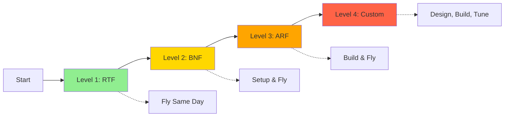
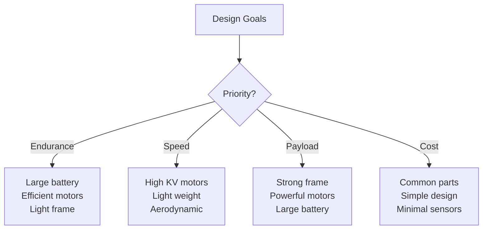
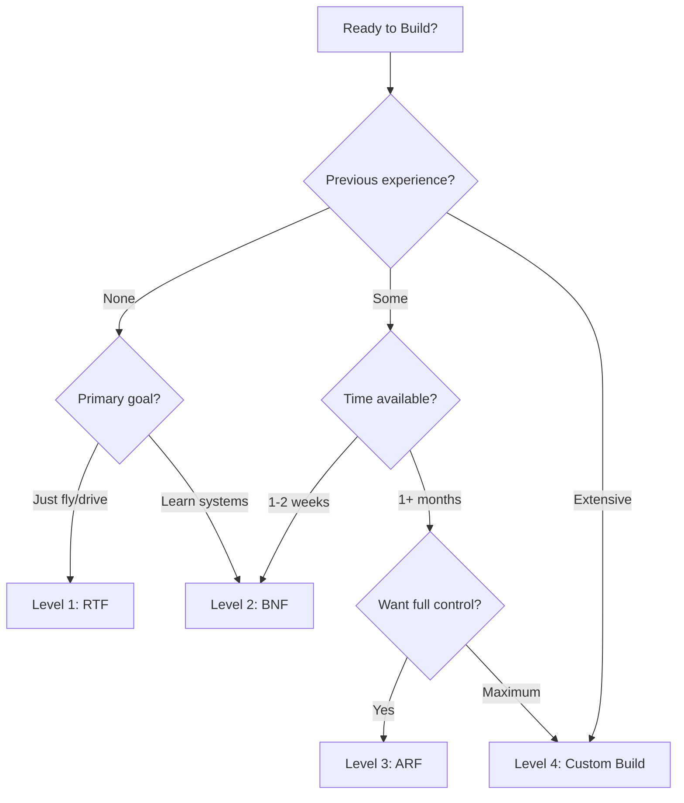

# First Build Pathways

Choose your pathway based on experience level, time commitment, and learning goals. Each level builds upon the previous, creating a progressive learning experience.

## Pathway Overview



| Level | Name | Time to Operation | Skill Required | Learning Depth | Cost Range |
|-------|------|-------------------|----------------|----------------|------------|
| **1** | Ready-to-Fly (RTF) | 1-2 hours | Beginner | Basic operation | $75-300 |
| **2** | Bind-and-Fly (BNF) | 1-3 days | Novice | Radio systems | $150-400 |
| **3** | Almost-Ready-to-Fly (ARF) | 1-3 weeks | Intermediate | Electronics & assembly | $300-800 |
| **4** | Custom Build | 1-3 months | Advanced | Full system design | $400-1,500+ |

## Level 1: Ready-to-Fly (RTF)

### 🎯 Best For
- Absolute beginners
- Quick start to flying/driving
- Focus on piloting skills
- Educational settings with limited time
- Those who want to learn programming before hardware

### 📦 What You Get
- Complete vehicle, fully assembled
- Controller/transmitter included
- Battery and charger included
- Instructions and basic documentation
- Ready to operate out of the box

### 🔧 Assembly Required
- **Minimal:** Charge battery, power on, follow quick-start guide
- **Time:** 30 minutes to 2 hours

### 📚 What You'll Learn
- Basic operation and controls
- Safety procedures
- Battery management
- Flight/driving characteristics
- Basic troubleshooting

### ✅ Recommended Platforms

#### Aerial - DJI Tello ($100)
```
✅ Perfect beginner drone
✅ Programmable (Python, Scratch)
✅ Stable indoor flight
✅ Propeller guards included
✅ 13-minute flight time
❌ Not ideal for outdoor/windy conditions
```

**Project Timeline:**
- Day 1: Unbox, charge, fly (30 min setup + practice)
- Week 1: Master basic controls
- Week 2-4: Try programming features

**Next Steps:** Learn Python with DJI Tello SDK, then upgrade to BNF drone

---

#### Ground - Basic Arduino Robot Car ($75-100)
```
✅ Pre-assembled electronics
✅ USB programmable
✅ Expandable with sensors
✅ Safe, ground-based
❌ Limited initial capabilities
```

**Project Timeline:**
- Day 1: Unbox, basic drive test
- Week 1: Explore pre-loaded programs
- Week 2+: Add sensors, customize code

**Next Steps:** Add ultrasonic sensors, line-following, then build custom rover

---

#### Marine - Basic RC Boat RTF ($100-150)
```
✅ Waterproof out of box
✅ Includes transmitter
✅ Simple operation
❌ Limited upgrade path
```

**Project Timeline:**
- Day 1: Charge, water test
- Week 1: Practice maneuvering
- Week 2+: Learn about waterproofing for modifications

**Next Steps:** Modify with Arduino/Pi for autonomous operation

---

### 💡 Success Tips

!!! tip "Level 1 Best Practices"
    1. **Read the manual completely** before first power-up
    2. **Start in a large, open space** with no obstacles
    3. **Practice in simulator first** if available
    4. **Fly/drive at beginner mode** (if available)
    5. **Keep first sessions short** (5-10 minutes) to build confidence
    6. **Join online community** for your specific platform

### 🚀 Progression Path
Once comfortable with Level 1:

- Add accessories (camera, LED lights)
- Try basic programming (if supported)
- Understand each component's function
- Move to Level 2 for more control options

---

## Level 2: Bind-and-Fly (BNF)

### 🎯 Best For
- Those with RC hobby experience
- Learning radio control systems
- More platform choices than RTF
- Better performance than entry-level
- Preparing for custom builds

### 📦 What You Get
- Complete vehicle, fully assembled
- Flight controller/electronics configured
- Motors, ESCs, and sensors installed
- **NO transmitter/receiver** (you choose your own)

### 🔧 Assembly Required
- Purchase compatible radio transmitter
- Bind receiver to transmitter
- Install receiver in vehicle
- Basic configuration/calibration
- **Time:** 2-8 hours (first time), 30 min (subsequent)

### 📚 What You'll Learn
- Radio protocols (SBUS, PPM, DSM2/DSMX)
- Transmitter/receiver binding
- Channel mapping
- Basic configuration software
- Receiver installation

### ✅ Recommended Platforms

#### Aerial - BetaFPV Cetus Pro Kit ($150)
```
✅ Includes basic transmitter option
✅ Safe for indoor practice
✅ FPV capability (first-person view)
✅ Durable design
✅ Upgradeable
❌ Short flight time (4-6 min)
```

**What You Need to Add:**
- Better transmitter (optional): $50-100
- FPV goggles (optional): $100-300
- Extra batteries: $30-50

**Project Timeline:**
- Day 1: Bind radio, setup (2-4 hours)
- Day 2-3: Calibration and first flights
- Week 1-2: Master LOS (line-of-sight) flying
- Week 3+: Try FPV flying

**Next Steps:** Build custom 5" racing quad

---

#### Ground - Raspberry Pi Smart Robot Car ($150-200)
```
✅ Pi 4 included
✅ Camera module
✅ Bluetooth/WiFi control
✅ Python programmable
✅ Expandable I/O
```

**What You Need to Add:**
- MicroSD card: $10-15
- Power bank or extra batteries: $20-30
- Sensors (optional): $20-50

**Project Timeline:**
- Day 1: Assemble hardware (3-5 hours)
- Day 2: Install OS, test basic functions
- Week 1: Learn Python control
- Week 2+: Add computer vision, sensors

**Next Steps:** Integrate ROS, build custom autonomous platform

---

### 💡 Success Tips

!!! tip "Level 2 Best Practices"
    1. **Research transmitter compatibility** before purchasing
    2. **Use simulator** with your actual transmitter
    3. **Understand binding procedure** for your protocol
    4. **Label all channels** on transmitter
    5. **Test controls before first flight** (motors off, check surfaces)
    6. **Keep bind plug/button accessible** for re-binding

### 🛠️ Common Tasks You'll Master
- Binding transmitter to receiver
- Configuring failsafe settings
- Adjusting control throws and rates
- Understanding trim settings
- Basic flight mode setup

### 🚀 Progression Path
- Master different flight/drive modes
- Tune PID settings (basic)
- Understand telemetry data
- Move to Level 3 for hands-on building

---

## Level 3: Almost-Ready-to-Fly (ARF)

### 🎯 Best For
- Makers and tinkerers
- Learning electronics and assembly
- Full understanding of components
- Customization and upgrades
- Serious hobbyists

### 📦 What You Get
- Frame/chassis
- Motors (may need mounting)
- ESCs (may need wiring)
- Flight controller (may need configuration)
- Some assembly required

### 🔧 Assembly Required
- Solder all connections
- Mount and wire all components
- Install and configure firmware
- Calibrate sensors
- Tune PID loops
- **Time:** 10-40 hours (first build)

### 📚 What You'll Learn
- Soldering techniques
- Wiring diagrams and schematics
- Flight controller configuration
- Sensor calibration (IMU, compass, GPS)
- PID tuning fundamentals
- Troubleshooting electrical issues
- Safety testing procedures

### ✅ Recommended Platforms

#### Aerial - 5" Freestyle Quadcopter ARF Kit ($300-600)

**Parts List:**
```
Frame: $40-80 (carbon fiber, 5" class)
Motors (4x): $80-120 (2306 or 2207, 2400-2600kv)
ESC (4-in-1): $40-80 (35A or higher)
Flight Controller: $40-70 (F4 or F7 with OSD)
FPV Camera: $25-40
Video Transmitter (VTX): $25-45
Receiver: $20-35
Batteries (3x 4S): $90-150
Propellers (10 sets): $20
Charger: $50-100
Tools/misc: $50-80
```

**Additional Needed:**
- Radio transmitter: $100-200
- FPV goggles: $200-400

**Project Timeline:**
- Week 1: Research, order parts
- Week 2: Parts arrive, inventory check
- Week 3: Solder and assemble (8-12 hours)
- Week 4: Configure firmware, initial test
- Week 5: Tuning and first flights
- Month 2+: Master flying, tuning optimization

**Next Steps:** Design custom frame, experiment with different configurations

---

#### Ground - Custom 4WD Rover with Pixhawk ($400-600)

**Parts List:**
```
Chassis kit: $80-120
Motors (4x): $60-100
Motor drivers: $30-50
Pixhawk flight controller: $100-200
GPS module: $30-60
Telemetry radio: $50-80
Battery (2S-4S LiPo): $40-60
Wheels/tires: $40-60
Receiver: $25-40
Misc (wires, connectors): $30-50
```

**Project Timeline:**
- Week 1-2: Assembly and wiring (10-15 hours)
- Week 3: Pixhawk configuration
- Week 4: Calibration and tuning
- Month 2: Autonomous missions
- Month 3+: Add sensors, advanced features

**Next Steps:** Integrate ROS, add vision system, outdoor navigation

---

### 💡 Success Tips

!!! tip "Level 3 Best Practices"
    1. **Triple-check wiring before power-on** - use diagrams
    2. **Test components individually** before final assembly
    3. **Use smoke stopper** on first power-up
    4. **Take photos during assembly** for reference
    5. **Keep build log** to document configuration
    6. **Join platform-specific forums** for build help
    7. **Don't rush** - careful assembly prevents problems

### 🛠️ Essential Skills You'll Develop
- **Soldering:** Clean joints, proper heat, flux use
- **Wiring:** Color coding, strain relief, proper routing
- **Configuration:** Betaflight/ArduPilot/PX4 setup
- **Calibration:** Accelerometer, compass, ESC
- **Testing:** Methodical, safe power-up procedures
- **Tuning:** PID adjustment, filter configuration

### ⚠️ Common Pitfalls
- Incorrect motor direction (easy to fix in software)
- Cold solder joints (causes intermittent issues)
- Loose connectors (use hot glue for vibration)
- Skipping smoke test (can destroy components)
- Poor PID tunes (start conservative)

### 🚀 Progression Path
- Build multiple configurations
- Experiment with components
- Design custom parts (3D print mounts)
- Move to Level 4 for complete custom design

---

## Level 4: Custom Build from Scratch

### 🎯 Best For
- Engineers and researchers
- Unique requirements
- Maximum learning
- Platform development
- Research and experimentation

### 📦 What You Get
- **Nothing pre-made** - you source everything
- Complete design freedom
- Deep understanding of every aspect

### 🔧 Assembly Required
- CAD design (frame/chassis)
- Component selection and sizing
- Electrical system design
- Software/firmware development or heavy customization
- Extensive testing and iteration
- **Time:** 40-200+ hours

### 📚 What You'll Learn
- Mechanical design and CAD
- Component selection and tradeoffs
- Power system calculations
- Control theory and implementation
- Sensor fusion algorithms
- System integration
- Flight dynamics / vehicle dynamics
- Advanced troubleshooting
- Iterative design process

### ✅ Example Projects

#### Custom Long-Range Quadcopter

**Design Specifications:**
- **Goal:** 1-hour flight time, 10km range
- **Payload:** 4K camera, telemetry
- **Features:** GPS waypoints, return-to-home

**Design Process:**
1. **Requirements analysis** (1 week)
   - Flight time calculations
   - Weight budget
   - Power requirements

2. **Component selection** (1-2 weeks)
   - Motor/prop efficiency testing
   - Battery chemistry selection
   - Long-range radio research

3. **CAD design** (2-3 weeks)
   - Frame optimization for efficiency
   - Aerodynamic considerations
   - Component mounting

4. **Procurement** (1-2 weeks)
   - Order components
   - 3D print custom parts

5. **Assembly** (2-3 weeks)
   - Precise building
   - Weight tracking
   - Vibration isolation

6. **Software configuration** (2-4 weeks)
   - Custom Ardupilot parameters
   - Mission planning
   - Failsafe setup

7. **Testing & tuning** (4-8 weeks)
   - Short test flights
   - PID optimization
   - Range testing
   - Endurance validation

**Total Timeline:** 3-6 months

---

#### Autonomous Research Rover

**Design Specifications:**
- **Goal:** Outdoor autonomous navigation
- **Payload:** LiDAR, stereo camera, compute module
- **Features:** SLAM, obstacle avoidance, ROS integration

**Design Process:**
1. **Requirements** (1 week)
2. **Architecture design** (2 weeks) - compute, sensors, communication
3. **Mechanical design** (3-4 weeks) - suspension, weatherproofing
4. **Electrical design** (2 weeks) - power distribution, CAN bus
5. **Procurement** (2-3 weeks)
6. **Assembly** (3-4 weeks)
7. **Software development** (6-12 weeks) - ROS nodes, algorithms
8. **Testing** (8+ weeks) - iterative outdoor testing

**Total Timeline:** 6-12 months

---

### 💡 Success Tips

!!! tip "Level 4 Best Practices"
    1. **Document everything** - design decisions, code, tests
    2. **Use version control** (Git) for all software
    3. **Design modular systems** - easy to swap components
    4. **Build in test points** - enable debugging
    5. **Progressive testing** - don't test everything at once
    6. **Expect failures** - budget time for redesigns
    7. **Peer review** - have others check your designs
    8. **Safety margins** - overspec critical components

### 🛠️ Advanced Skills Required
- **CAD Software:** Fusion 360, SolidWorks, FreeCAD
- **Programming:** C++, Python, embedded systems
- **Electronics:** Schematic capture, PCB design (optional)
- **Mathematics:** Linear algebra, calculus, control theory
- **Tools:** 3D printing, CNC (optional), advanced soldering

### 📐 Design Considerations

#### Performance Trade-offs


#### System Integration Challenges
- **Power budget:** Ensure battery can supply all systems
- **Weight distribution:** Critical for aerial, important for ground
- **Vibration isolation:** Protect sensitive sensors
- **Thermal management:** Prevent overheating
- **EMI/RFI:** Minimize interference with GPS, radio
- **Waterproofing:** If outdoor/marine use

### 🔬 Testing Methodology

1. **Bench testing:**
   - Component verification
   - Power-on smoke test
   - Communication verification
   - Sensor readings validation

2. **Tethered testing (aerial):**
   - Tie down platform
   - Test motor directions
   - Verify control response
   - Check stability

3. **Controlled environment:**
   - Indoor hover/drive tests
   - Basic maneuvers
   - Failsafe verification

4. **Progressive outdoor:**
   - Short missions
   - Gradual complexity increase
   - Data logging and analysis

5. **Performance validation:**
   - Meet design specifications
   - Safety margin verification
   - Long-term reliability testing

### 🚀 Progression Path
- Publish your design (open source)
- Contribute to open-source projects (ArduPilot, PX4)
- Research applications
- Commercial product development

---

## Choosing Your Pathway

### Decision Matrix



### Quick Recommendations

**"I want to fly TODAY"**
→ Level 1 (RTF)

**"I have RC car experience"**
→ Level 2 (BNF)

**"I want to build and understand everything"**
→ Level 3 (ARF)

**"I'm an engineering student/researcher"**
→ Level 4 (Custom)

**"I'm teaching a class"**
→ Level 1 for class sets, Level 3 for advanced students

**"I want to race FPV drones"**
→ Start Level 1 (micro), progress to Level 3 (custom 5")

**"I want autonomous missions"**
→ Level 1 (Tello with programming) or Level 3-4 (Pixhawk)

## Resources for Each Level

### Level 1 Resources
- **DJI Tello:** Official app, Python SDK documentation
- **YouTube:** Beginner flying tutorials
- **Simulators:** Free mobile apps

### Level 2 Resources
- **Oscar Liang:** Comprehensive FPV guides
- **RC Groups:** Forums for all RC platforms
- **Simulators:** Velocidrone, Liftoff, DRL Simulator

### Level 3 Resources
- **Joshua Bardwell:** FPV build tutorials (YouTube)
- **Painless360:** ArduPilot tutorials
- **Betaflight Wiki:** Configuration documentation
- **Discord:** Platform-specific build help servers

### Level 4 Resources
- **ArduPilot/PX4 Docs:** Advanced configuration
- **ROS Tutorials:** Robot Operating System
- **Research Papers:** Latest algorithms
- **GitHub:** Open-source projects
- **University Courses:** Controls, robotics, AI

## Safety Across All Levels

!!! danger "Universal Safety Rules"
    Regardless of your pathway:

    - ✅ Read ALL [Safety & Compliance](../safety-compliance/index.md) documentation
    - ✅ Understand [Battery Safety](../safety-compliance/battery-safety.md)
    - ✅ Follow [FAA Regulations](../safety-compliance/faa-regulations.md)
    - ✅ Use proper safety equipment
    - ✅ Test in safe, controlled environments
    - ✅ Never skip preflight/pre-drive checks
    - ✅ Have emergency procedures planned

## Next Steps

### Ready to Start?

1. ✅ Choose your pathway level
2. ✅ Review [Prerequisites](prerequisites.md) for that level
3. ✅ Confirm platform selection from [Platform Guide](selecting-your-platform.md)
4. ✅ Read relevant safety documentation
5. ✅ Order your platform and required tools
6. ✅ Join community for your chosen platform

### Need More Information?

- **Platform unclear?** See [Platform Selection](selecting-your-platform.md)
- **Safety questions?** Review [Safety & Compliance](../safety-compliance/index.md)
- **Terminology?** Check [Glossary](../glossary/index.md)

---

**Last Updated:** November 2025
**Related Topics:** [Platform Selection](selecting-your-platform.md) | [Prerequisites](prerequisites.md) | [Safety Compliance](../safety-compliance/index.md)
