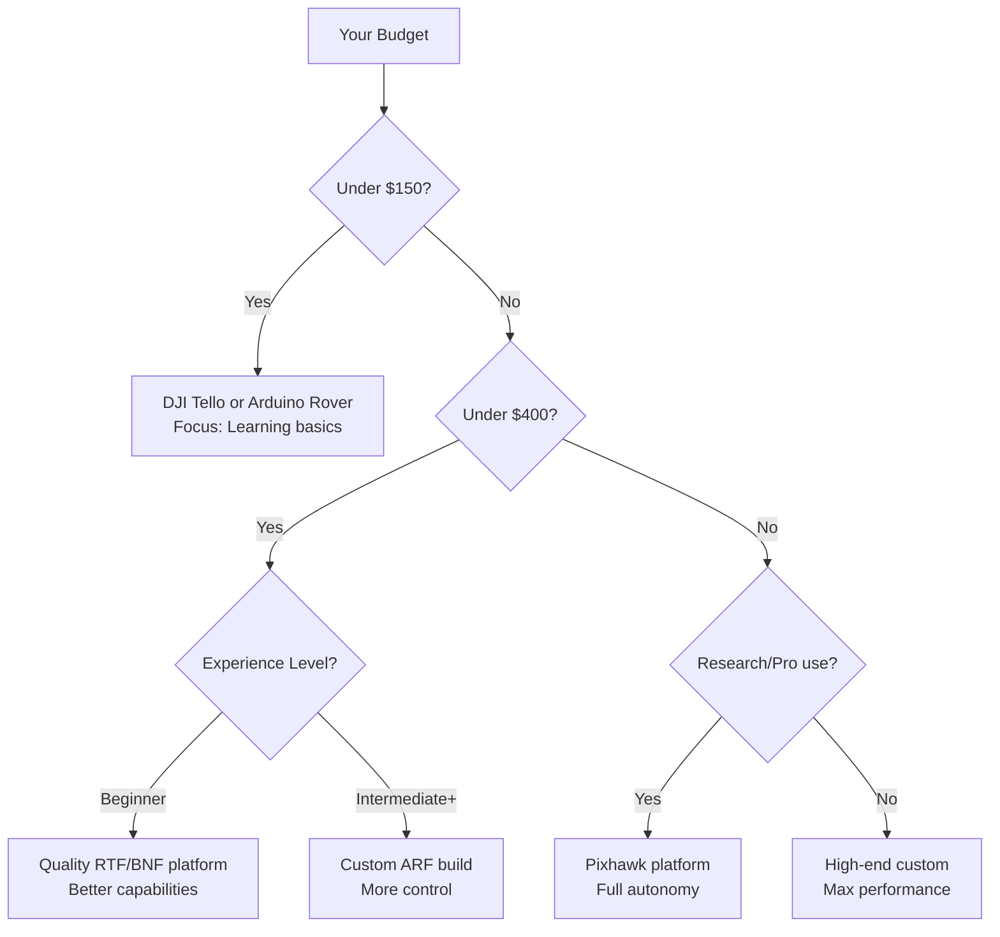

# Selecting Your Platform

Choosing your first unmanned vehicle platform is one of the most important decisions in your learning journey. This guide will help you make an informed choice based on your goals, budget, and experience level.

## Decision Framework

Consider these key factors:

1. **Primary Goal** - What do you want to learn or accomplish?
2. **Budget** - How much can you invest?
3. **Skill Level** - What's your technical background?
4. **Environment** - Where will you operate? (indoor/outdoor, terrain, space constraints)
5. **Time Commitment** - How much time can you dedicate?
6. **Regulatory Constraints** - What are local laws and school policies?

## Quick Recommendation Quiz

Answer these questions to narrow your options:

??? question "1. What's your primary interest?"

    - **Photography/videography** → Aerial (camera drone)
    - **Robotics and sensors** → Ground (rover)
    - **Unique challenge/water access** → Marine (boat)
    - **Speed and agility** → Aerial (racing drone)
    - **Algorithm development** → Any (choose by environment)

??? question "2. What's your budget range?"

    - **Under $100** → DJI Tello, basic Arduino rover, or modified toy RC
    - **$100-$300** → Better drones, quality rover kits, basic USV
    - **$300-$600** → Custom quad builds, ROS rovers, Pixhawk platforms
    - **$600+** → Advanced custom builds, research-grade platforms

??? question "3. What's your skill level?"

    - **Complete beginner** → RTF platforms (Level 1)
    - **Some electronics experience** → BNF platforms (Level 2)
    - **Maker/hobbyist** → ARF platforms (Level 3)
    - **Advanced/engineer** → Custom builds (Level 4)

??? question "4. Where will you operate?"

    - **Indoor only** → Small micro drone or compact rover
    - **Outdoor open space** → Larger UAV or outdoor rover
    - **Mixed environments** → Versatile platform with multiple modes
    - **Water available** → USV platform

## Platform Comparison Matrix

### Aerial Platforms (UAVs/Drones)

| Platform | Type | Skill Level | Cost | Flight Time | Best For | Pros | Cons |
|----------|------|-------------|------|-------------|----------|------|------|
| **DJI Tello** | Micro quad | Beginner | $100 | 13 min | Indoor learning, programming | Programmable, stable, cheap | Limited outdoor use, weak in wind |
| **DJI Mini 4 Pro** | Camera drone | Beginner-Int | $750 | 34 min | Photography, videography | Professional quality, regulations-friendly | Expensive, limited customization |
| **BetaFPV Cetus Pro** | Micro FPV | Beginner | $150 | 5 min | FPV learning, racing | Safe, FPV experience | Very short flight time |
| **EMAX Tinyhawk** | FPV racer | Intermediate | $130-200 | 4-6 min | Indoor racing | Durable, fun, upgradeable | Requires FPV goggles ($200+) |
| **Custom 5" Racer** | Custom quad | Advanced | $300-600 | 4-8 min | Racing, freestyle | Fully customizable, high performance | Complex build, requires soldering |
| **Pixhawk ARF** | Multi-purpose | Advanced | $400-800 | 15-25 min | Research, mapping, custom missions | Open-source, full autonomy capable | Steep learning curve |

### Ground Platforms (UGVs/Rovers)

| Platform | Type | Skill Level | Cost | Power | Best For | Pros | Cons |
|----------|------|-------------|------|-------|----------|------|------|
| **Arduino Car Kit** | 2WD/4WD | Beginner | $50-100 | Battery | Learning basics | Cheap, simple, abundant tutorials | Limited capability |
| **Raspberry Pi Rover** | 4WD | Intermediate | $150-250 | Battery | Computer vision, AI | Powerful processor, camera support | Requires programming |
| **TurtleBot3** | Diff drive | Intermediate | $500-900 | Battery | ROS learning, SLAM | Industry-standard ROS platform | Expensive, indoor focus |
| **Traxxas RC Mod** | 4WD truck | Intermediate | $200-400 | Battery | Outdoor terrain | Durable, fast, hobby-grade parts | Requires modification |
| **Custom 6WD** | All-wheel | Advanced | $300-700 | Battery | Rough terrain | Excellent mobility | Complex build |
| **Clearpath Husky** | Professional | Advanced | $10,000+ | Battery | Research | Research-grade, ROS-native | Very expensive |

### Marine Platforms (USVs)

| Platform | Type | Skill Level | Cost | Operation | Best For | Pros | Cons |
|----------|------|-------------|------|-----------|----------|------|------|
| **Modified RC Boat** | Surface | Beginner | $100-200 | Freshwater | Basic learning | Cheap entry point | Limited capability, manual control |
| **DIY USV** | Surface | Intermediate | $300-500 | Fresh/salt | Custom projects | Customizable | Waterproofing challenges |
| **Pixhawk Boat** | Surface | Advanced | $500-1000 | Fresh/salt | Autonomous missions | Full autonomy | Complex setup, corrosion concerns |
| **BlueROV2** | Underwater | Advanced | $3,500+ | Underwater | Underwater inspection | Professional-grade | Very expensive, requires tether |

## Detailed Platform Analysis

### 🥇 Top Recommendations by Category

#### **Best for Absolute Beginners: DJI Tello ($100)**

**Why we recommend it:**

- ✅ Ready to fly out of the box
- ✅ Extremely stable (automatic hover)
- ✅ Programmable (Python, Scratch)
- ✅ Indoor safe (propeller guards)
- ✅ Affordable
- ✅ Abundant learning resources

**Limitations:**

- ❌ Weak in outdoor wind
- ❌ No GPS (drifts outdoors)
- ❌ Short range (~100m)
- ❌ Limited upgrade path

**Best for:** Students, indoor education, programming introduction

---

#### **Best for Learning Robotics: Arduino-Based Rover ($75-150)**

**Why we recommend it:**

- ✅ Teaches electronics fundamentals
- ✅ Easy to modify and expand
- ✅ Safe (ground-based, slow speed)
- ✅ Huge community support
- ✅ Adds sensors easily

**Limitations:**

- ❌ Requires basic soldering/assembly
- ❌ Limited out-of-box capability
- ❌ Can be fragile

**Best for:** Hands-on learners, robotics education, sensor integration

---

#### **Best for Customization: 5-inch Custom Quadcopter ($300-600)**

**Why we recommend it:**

- ✅ Complete control over components
- ✅ Upgradeable and repairable
- ✅ High performance
- ✅ Large community (FPV racing)
- ✅ Teaches electronics deeply

**Limitations:**

- ❌ Requires soldering
- ❌ Complex initial setup
- ❌ Can crash and break
- ❌ Needs FPV goggles for racing

**Best for:** Makers, tinkerers, those wanting deep understanding

---

#### **Best for Research/Advanced Work: Pixhawk-Based Platform ($400-800)**

**Why we recommend it:**

- ✅ Industry-standard autopilot
- ✅ Full autonomous capability
- ✅ Open-source (ArduPilot/PX4)
- ✅ Supports complex missions
- ✅ Extensive sensor support
- ✅ Works on air/land/sea platforms

**Limitations:**

- ❌ Steep learning curve
- ❌ Requires configuration expertise
- ❌ More expensive
- ❌ Complex troubleshooting

**Best for:** Advanced students, researchers, professional applications

## Budget vs. Capability Analysis

### Cost Breakdown Examples

#### Entry Level: DJI Tello Setup ($175 total)
- DJI Tello: $100
- Extra batteries (2): $40
- Propeller guards (if not included): $15
- Landing pad: $10
- Carrying case: $10

#### Intermediate: Custom Rover ($350 total)
- Raspberry Pi 4: $55
- Motor driver: $15
- Motors & wheels: $40
- Chassis kit: $60
- Battery & charger: $50
- Camera module: $30
- Sensors (ultrasonic, IMU): $40
- Miscellaneous (wires, mounts): $60

#### Advanced: 5" FPV Racing Quad ($800 total)
- Frame: $40
- Motors (4): $100
- ESCs (4-in-1): $60
- Flight controller: $50
- FPV camera: $30
- VTX (video transmitter): $35
- Receiver: $25
- Propellers (sets): $20
- Battery (LiPo 4S, 3 pcs): $120
- Charger: $60
- **FPV goggles: $300**
- Radio transmitter: $100
- Tools & misc: $60

!!! tip "Hidden Costs"
    Always budget for:

    - **Spare parts** (propellers, batteries break)
    - **Tools** (screwdrivers, soldering iron, multimeter)
    - **Safety equipment** (fire-resistant LiPo bag)
    - **Shipping** (often $20-50 for international orders)
    - **Registration** (FAA requires $5 for drones >250g in USA)

## Use Case Matching

### I want to learn programming
**Recommended:** DJI Tello or Raspberry Pi rover

**Why:** Both have excellent Python libraries and educational resources. Tello uses simple SDK, Rover allows GPIO control.

---

### I want to take photos/videos
**Recommended:** DJI Mini 4 Pro or Mavic series

**Why:** Built-in stabilized cameras, reliable GPS, long flight times, automatic flight modes.

---

### I want to race drones
**Recommended:** Start with BetaFPV Cetus Pro, progress to custom 5"

**Why:** Racing requires FPV flying skills. Start small and safe, upgrade as skills develop.

---

### I want to build from scratch
**Recommended:** Custom quadcopter or Arduino/Pi rover

**Why:** Complete control over design. Learn electronics, soldering, troubleshooting.

---

### I want autonomous missions
**Recommended:** Pixhawk-based platform (aerial, ground, or marine)

**Why:** Industry-standard autopilot with waypoint navigation, geofencing, return-to-home.

---

### I want to teach a class
**Recommended:** DJI Tello (multiple units) or Arduino rover kits

**Why:** Affordable enough for class sets, safe, educational software available, robust.

---

### I want to compete in robotics competitions
**Recommended:** Check competition rules first

**Common platforms:** VEX robots, FIRST Robotics platforms, custom Arduino/Pi builds.

## Common Pitfalls to Avoid

### ❌ **Pitfall 1: Buying Too Advanced Too Soon**

**Problem:** Jumping to a complex custom build without basics

**Solution:** Start with RTF/BNF, learn fundamentals, then upgrade

**Example:** Don't start with a custom 7" long-range quad if you've never flown before

---

### ❌ **Pitfall 2: Ignoring Battery Requirements**

**Problem:** Not budgeting for multiple batteries and proper charger

**Solution:** Buy at least 3 batteries and a quality charger from the start

**Why:** Charge times are long (1-2 hours), flight times are short (5-25 minutes)

---

### ❌ **Pitfall 3: Choosing Wrong Scale**

**Problem:** Buying outdoor drone without outdoor space, or fragile indoor drone for outdoors

**Solution:** Match platform size/capability to your actual operating environment

**Example:** DJI Mini is great outdoors but drifts indoors; Tello is perfect indoors but struggles in wind

---

### ❌ **Pitfall 4: Underestimating Learning Curve**

**Problem:** Expecting to fly autonomously immediately

**Solution:** Plan for weeks/months of learning, start with manual control

**Reality check:** Even "beginner" platforms require practice and study

---

### ❌ **Pitfall 5: Forgetting Regulations**

**Problem:** Buying drone that requires registration or licensing

**Solution:** Check [FAA Regulations](../safety-compliance/faa-regulations.md) BEFORE purchasing

**Example:** In USA, drones >250g require FAA registration ($5)

---

### ❌ **Pitfall 6: Cheap Components**

**Problem:** Buying lowest-cost clone products that fail quickly

**Solution:** Stick to recommended brands; read reviews

**Trusted brands:**
- **Flight controllers:** Pixhawk, Betaflight-compatible
- **Motors:** T-Motor, iFlight, EMAX
- **Batteries:** Tattu, Gens Ace
- **Electronics:** Hobbywing, BLHeli ESCs

## Platform Selection Checklist

Before making your final decision:

- [ ] Reviewed budget including all accessories
- [ ] Checked local regulations and restrictions
- [ ] Confirmed available operating space
- [ ] Assessed skill level honestly
- [ ] Read reviews from multiple sources
- [ ] Verified spare parts availability
- [ ] Considered long-term upgrade path
- [ ] Reviewed safety requirements
- [ ] Checked if school/institution allows this platform
- [ ] Identified local community/support resources

## Next Steps

Once you've selected your platform:

1. ✅ Review [Prerequisites](prerequisites.md) for required tools and knowledge
2. ✅ Read **all** [Safety & Compliance](../safety-compliance/index.md) documentation
3. ✅ Purchase platform and required accessories (use checklist above)
4. ✅ Follow appropriate pathway in [First Build Pathways](first-build-pathways.md)

## Need More Help?

- 📖 **Terms unclear?** See [Glossary](../glossary/index.md)
- 💬 **Community input?** Check forums (RCGroups, DIY Drones, Reddit r/Multicopter, r/robotics)
- 🐛 **Found outdated info?** [Report an issue](https://github.com/F3DESIGNED/unmanned-vehicle-edu-hub/issues)

---

**Last Updated:** November 2025
**Related Topics:** [Introduction](introduction-to-unmanned-systems.md) | [Prerequisites](prerequisites.md) | [First Build Pathways](first-build-pathways.md)
