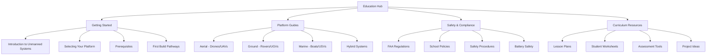
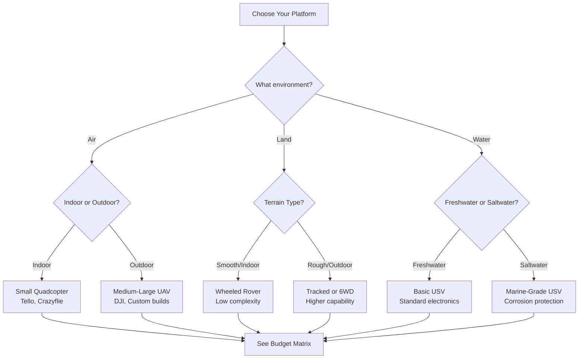

# Welcome to the Unmanned Vehicle Systems Education Hub

## Our Mission

Empowering the next generation of engineers and innovators through hands-on experience with unmanned vehicle systems. This hub provides comprehensive, accessible resources for students, educators, hobbyists, and researchers to explore aerial, ground, and marine autonomous platforms.

## Navigation Map

## Quick Start by User Role

### 👨‍🎓 Students
**"I want to build my first drone/rover/boat"**

1. Start with [Introduction to Unmanned Systems](getting-started/introduction-to-unmanned-systems.md)
2. Review [Safety Procedures](safety-compliance/safety-procedures.md) and [Battery Safety](safety-compliance/battery-safety.md)
3. Choose your path in [First Build Pathways](getting-started/first-build-pathways.md)
4. Explore the [Glossary](glossary/index.md) for terminology

**Recommended Starting Point:** Level 1 - Ready-to-Fly (RTF) platforms

---

### 👨‍🏫 Educators & Teachers
**"I want to integrate unmanned systems into my curriculum"**

1. Review [School Policies](safety-compliance/school-policies.md) and templates
2. Complete [Student Safety Training](safety-compliance/student-safety-training.md) requirements
3. Browse [Curriculum Resources](../resources/lesson-plans/.gitkeep) (coming in Phase 2)
4. Use [Platform Selection Guide](getting-started/selecting-your-platform.md) for budget planning

**Key Resource:** Downloadable safety policy templates for your institution

---

### 🔧 Hobbyists & Makers
**"I want to customize and experiment with autonomous systems"**

1. Check [Prerequisites](getting-started/prerequisites.md) for required skills
2. Jump to [First Build Pathways](getting-started/first-build-pathways.md) - Level 2 or 3
3. Explore platform-specific guides (coming in Phase 2)
4. Join the community through [Contributing](../CONTRIBUTING.md)

**Recommended Starting Point:** Level 2 - Bind-and-Fly (BNF) or Almost-Ready-to-Fly (ARF)

---

### 🔬 Researchers & Advanced Users
**"I need a platform for algorithm development and testing"**

1. Start with [Platform Selection Guide](getting-started/selecting-your-platform.md) for technical comparisons
2. Review Level 4 (Custom Builds) in [First Build Pathways](getting-started/first-build-pathways.md)
3. Access code libraries and examples (coming in Phase 2)
4. Explore integration with research frameworks (PX4, ArduPilot, ROS)

**Recommended Starting Point:** Level 3-4 - ARF or Custom builds with open-source flight controllers

---

### 🚀 Advanced Learners
**"I've mastered the basics and want to go deeper"**

1. Explore [Advanced Topics](advanced/) - Computer vision, AI, swarm robotics
2. Choose a specialization in [Specialized Applications](advanced/specialized-applications/)
3. Consider [Research Projects](advanced/research-projects/) for thesis work
4. Connect to [Career Pathways](career-pathways/) for your interests

**Recommended Starting Point:** [Advanced Topics Overview](advanced/)

---

### 💼 Career-Focused Students & Job Seekers
**"I want to turn this into a career"**

1. Explore [Career Pathways](career-pathways/) by industry sector
2. Review [Certification Requirements](career-pathways/certifications/)
3. Find [Internship Opportunities](career-pathways/internships/)
4. Build portfolio with [Advanced Projects](advanced/)

**Recommended Starting Point:** [Career Pathways Overview](career-pathways/)

---

## Platform Selection Decision Tree

## Featured Pathways

### 🚁 **Aerial Systems (UAVs/Drones)**
Perfect for: Photography, surveying, research, racing
- **Beginner:** DJI Tello ($100) - programmable indoor drone
- **Intermediate:** Custom 250mm racing quad ($200-400)
- **Advanced:** Pixhawk-based mapping drone ($600+)

[Explore Aerial Platforms →](platforms/.gitkeep)

### 🚗 **Ground Systems (UGVs/Rovers)**
Perfect for: Robotics education, autonomous navigation, STEM competitions
- **Beginner:** Modified RC car with Arduino ($75-150)
- **Intermediate:** ROS-based rover with sensors ($300-500)
- **Advanced:** Custom outdoor autonomous platform ($800+)

[Explore Ground Platforms →](platforms/.gitkeep)

### 🚤 **Marine Systems (USVs/Boats)**
Perfect for: Environmental monitoring, unique engineering challenges
- **Beginner:** Modified RC boat ($100-200)
- **Intermediate:** Pixhawk marine platform ($400-600)
- **Advanced:** Custom research vessel ($1000+)

[Explore Marine Platforms →](platforms/.gitkeep)

## Safety First! ⚠️

Before starting any build or flight:

!!! danger "Critical Safety Requirements"
    - **ALWAYS** read [Battery Safety](safety-compliance/battery-safety.md) before charging/using LiPo batteries
    - Review [FAA Regulations](safety-compliance/faa-regulations.md) for legal flight requirements
    - Complete [Safety Procedures](safety-compliance/safety-procedures.md) training
    - Use appropriate [Personal Protective Equipment](safety-compliance/safety-procedures.md#ppe)

## Community & Support (NEW Phase 4B!)

### 🤝 Connect with the Community
- **[Community Hub](community/)** - Programs, events, and resources
- **[GitHub Discussions](https://github.com/F3DESIGNED/unmanned-vehicle-edu-hub/discussions)** - Ask questions, share projects
- **[Office Hours](community/events/office-hours/)** - Weekly drop-in support (Wednesdays 7-8 PM ET)
- **[Mentorship Program](community/mentorship/)** - Get paired with an experienced educator
- **[Learning Circles](community/learning-circles/)** - Join peer learning groups
- **[Monthly Challenges](community/events/monthly-challenges/)** - Build skills through hands-on practice
- **[Regional Chapters](community/regional-chapters/)** - Connect locally

### 📹 Learning Resources
- **[Video Library](../media/video-content/)** - Tutorials and demonstrations
- **[Interactive Content](interactive/)** - Simulators, virtual labs, and quizzes
- **[Accessibility Resources](accessibility/)** - Support for all learners

### 👩‍🎓 For Students
- **[Student Community](../resources/student-community/)** - Student-focused resources
- **[Project Showcase](../resources/student-community/project-showcase/)** - Share your work
- **[Career Exploration](../resources/student-community/career-exploration/)** - Explore career paths

### 👨‍🏫 For Educators
- **[Professional Learning Community](../resources/plc/)** - Ongoing PD and growth
- **[Certification Pathways](../resources/plc/certification-pathways/)** - Build expertise
- **[Contributor Recognition](community/recognition/)** - Get recognized for contributions

### General Support
- **Questions?** Check our [Glossary](glossary/index.md) for definitions
- **Found an issue?** See our [Contributing Guide](../CONTRIBUTING.md)
- **New to the field?** Start with [Introduction to Unmanned Systems](getting-started/introduction-to-unmanned-systems.md)

## What's Available Now

### ✅ Phase 1: Foundation
- Getting Started Documentation
- Safety and Compliance Guides
- Platform Selection Tools
- Comprehensive Glossary

### ✅ Phase 2: Technical Content
- UAV Build Guides
- UGV Build Guides
- Programming Resources
- Control Systems Documentation

### ✅ Phase 3: Support Resources
- Curriculum Integration
- Assessment Tools
- Troubleshooting Guides
- References and Standards

### ✅ Phase 4A: Validation Infrastructure
- Pilot Program Framework
- Assessment and Evaluation Tools
- Research Opportunities

### ✅ Phase 4B: Community & Multimedia
- **Community Infrastructure:** Mentorship, learning circles, events, regional chapters
- **Multimedia Content:** Video library, production guides, tutorials
- **Interactive Content:** Simulators, virtual labs, self-assessment quizzes
- **Accessibility:** WCAG compliance, accommodations for diverse learners
- **Student Community:** Project showcase, peer learning, career exploration
- **Professional Learning Community:** Certification pathways, ongoing PD

### ✅ Phase 4C: Advanced Learning & Sustainability (NEW!)
- **[Advanced Topics](advanced/):** Computer vision, AI, swarm robotics, advanced autonomy, specialized applications
- **[Career Pathways](career-pathways/):** Industry sectors, career profiles, certifications, internships, entrepreneurship
- **[Ethics & Sustainability](ethics-sustainability/):** Technology ethics, environmental impact, responsible operation
- **[Funding Resources](../resources/funding/):** Grant writing toolkit, program budgeting, sustainability planning
- **[Admin Advocacy](implementation/admin-advocacy/):** Pitch materials, ROI analysis, pilot proposals
- **[Program Scaling](implementation/scaling/):** Growth pathways from pilot to district-wide
- **[LMS Integration](../resources/lms-integration/):** Canvas, Google Classroom, Schoology, Moodle packages
- **[Quality Assurance](quality/):** Content standards, review processes, continuous improvement

## Coming Soon

🔜 **Phase 5:** Additional advanced content development, enhanced career connections, expanded specialized applications

---

**Last Updated:** November 2025
**License:** Documentation under CC-BY-SA 4.0 | Code under MIT License

[View on GitHub](https://github.com/F3DESIGNED/unmanned-vehicle-edu-hub) | [Report Issues](https://github.com/F3DESIGNED/unmanned-vehicle-edu-hub/issues)
