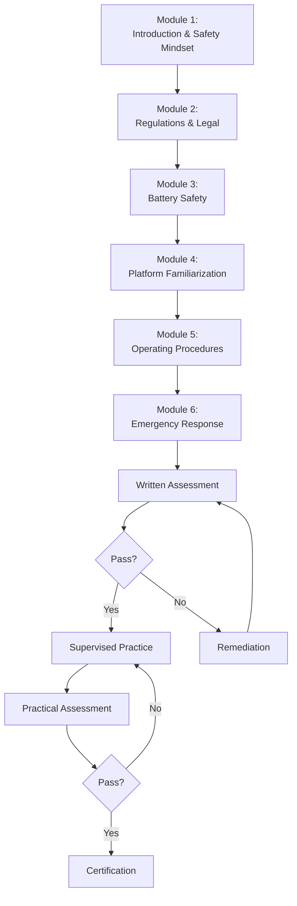

# Student Safety Training Program

!!! info "For Educators"
    This structured training program ensures students have the knowledge and skills to operate unmanned vehicles safely and legally.

## Program Overview

**Purpose:** Prepare students for safe, responsible operation of unmanned vehicle systems

**Duration:** 4-6 hours (can be spread over multiple sessions)

**Prerequisites:** Parent/guardian consent, minimum age requirements met

**Certification:** Students receive completion certificate upon passing assessment

**Validity:** Annual recertification recommended

## Training Structure



## Module 1: Introduction and Safety Mindset (30 minutes)

### Learning Objectives
- Understand why safety is paramount
- Recognize that operation is a privilege, not a right
- Internalize personal responsibility

### Topics

#### 1.1 What Are Unmanned Vehicles?

**Key points:**
- Definition and types (aerial, ground, marine)
- Common applications
- Why we use them in education

**Activity:** Show example platforms, discuss uses

---

#### 1.2 Why Safety Matters

**Real-world examples (age-appropriate):**
- Propeller injuries
- Battery fires
- Property damage incidents
- Regulatory violations and consequences

**Discussion:** What can go wrong and why we have rules

---

#### 1.3 Safety Culture

**Core principles:**
- **Personal responsibility** - YOU are responsible for YOUR actions
- **Speak up** - If something seems unsafe, say so
- **Checklists matter** - Every item, every time
- **No shortcuts** - Safety procedures exist for reasons
- **Continuous learning** - Always room to improve

**Activity:** Safety scenarios - "What would you do?"

---

#### 1.4 Rights and Privileges

**Understanding:**
- Operating unmanned vehicles is a **privilege**
- Privileges can be revoked
- With privilege comes responsibility
- One person's mistake affects everyone's access

**Expectations:**
- Follow all rules, always
- Respectful of equipment
- Respectful of others' safety
- Honest about mistakes (we learn from them)

---

### Assessment (Module 1)
- Short quiz (5 questions)
- Safety scenario discussion

## Module 2: Regulations and Legal Compliance (45 minutes)

### Learning Objectives
- Understand FAA rules (for aerial platforms)
- Know registration requirements
- Recognize restricted areas
- Complete TRUST test (if applicable)

### Topics

#### 2.1 FAA Regulations Overview (Aerial Platforms)

**Recreational flying rules:**
- Must pass TRUST test
- Register drone if >250g
- Fly below 400 feet
- Keep drone in sight
- Stay away from airports (5-mile notification rule)
- Never over people or moving vehicles
- Give way to manned aircraft

**Resource:** [FAA Regulations Guide](faa-regulations.md)

---

#### 2.2 TRUST Test Completion

**For students operating aerial platforms:**

1. **What it is:** FAA-required aeronautical knowledge test
2. **Who needs it:** All recreational drone operators
3. **How to complete:** Online, free, ~30 minutes
4. **Topics covered:** Safety, regulations, airspace
5. **Completion:** Print certificate, keep with drone

**Activity:** Students complete TRUST test
- Instructor monitors
- Certificates collected for records

**TRUST Test Providers:**
- [List of FAA-approved providers](https://www.faa.gov/uas/recreational_fliers/knowledge_test)

---

#### 2.3 School-Specific Policies

**Review:**
- Operating hours and locations
- Approval processes
- Supervision requirements
- Consequences of violations

**Reference:** Your school's policy (see [School Policies](school-policies.md) for template)

---

#### 2.4 Privacy and Ethics

**Important considerations:**
- Respect others' privacy
- No cameras over sensitive areas (bathrooms, locker rooms, etc.)
- Get permission before photographing people
- Use technology responsibly
- Digital citizenship applies

**Discussion:** Ethical scenarios

---

### Assessment (Module 2)
- TRUST test completion (aerial) or policy quiz
- Scenario-based questions on regulations

## Module 3: Battery Safety (45 minutes)

!!! danger "Critical Module"
    Battery safety is **life-safety training**. This module is mandatory and detailed.

### Learning Objectives
- Understand LiPo battery hazards
- Recognize damaged batteries
- Follow safe charging procedures
- Know emergency response to battery fire

### Topics

#### 3.1 Why Battery Safety Is Critical

**Facts:**
- LiPo batteries store massive energy
- Can catch fire or explode if mishandled
- Fires are intense and fast-spreading
- Proper handling prevents virtually all incidents

**Video:** LiPo fire demonstration (controlled)
*(Instructor shows video of controlled LiPo fire to demonstrate seriousness)*

---

#### 3.2 Understanding LiPo Batteries

**Basic concepts:**
- What LiPo stands for (Lithium Polymer)
- Cell count (1S, 2S, 3S, etc.)
- Voltage ranges (fully charged: 4.2V, danger: <3.0V per cell)
- Why they're used (high power, lightweight)

**Hands-on:** Show battery, identify components
- Cells (pouch)
- Main connector
- Balance connector
- Labels (voltage, capacity, C-rating)

---

#### 3.3 Recognizing Damaged Batteries

**NEVER USE if battery has:**
- ⚠️ **Swelling or puffing** (most common warning sign)
- ⚠️ Puncture or tear in wrapper
- ⚠️ Leaking
- ⚠️ Burnt smell or discoloration
- ⚠️ Damaged wires or connectors

**Activity:** Students examine batteries, sort safe vs. damaged

---

#### 3.4 Safe Charging Procedures

**Critical rules:**
1. **NEVER charge unattended** - Stay in room
2. **ALWAYS use LiPo safe bag** or metal container
3. **ALWAYS verify charger settings** before starting
4. **NEVER charge damaged battery**
5. **ALWAYS check battery every 5-10 minutes**

**Step-by-step demonstration:**
- Inspect battery
- Place in LiPo bag
- Connect balance lead
- Connect main lead
- Verify cell count on charger
- Set charge current (1C = capacity in amps)
- Select "LiPo Balance Charge"
- Double-check settings
- Start charge
- Monitor for heat, smell, sounds

**Hands-on:** Students practice setup (charger not started)

---

#### 3.5 Storage Safety

**Key points:**
- Store at "storage voltage" (3.8V/cell) if not using for 3+ days
- Use LiPo bag or metal container (with vent hole)
- Cool, dry location
- Away from flammables
- Check monthly

---

#### 3.6 Battery Fire Response

**If battery catches fire:**

1. **Alert everyone** - Shout "FIRE!" loudly
2. **Get away** - Move 20+ feet back
3. **Get adult immediately**
4. **DO NOT use water** - Makes it worse!
5. **Adult will:**
   - Use fire extinguisher (ABC type) OR
   - Smother with sand OR
   - Let burn in safe outdoor area
6. **Call 911** if fire is large or spreading

**Practice:** Fire drill simulation
- Students practice alerting and evacuation
- Review locations of fire extinguishers
- Walk through emergency exits

---

#### 3.7 Disposal

**When to dispose:**
- Any swelling
- Physical damage
- After many cycles (200-300)

**How to dispose:**
- DO NOT just throw away charged battery
- Discharge completely first (salt water method or charger)
- Take to battery recycling center
- Never burn or puncture

---

### Assessment (Module 3)
- **Written test:** 10 questions on battery safety
- **Practical demonstration:** Student sets up charging station correctly
- **Hazard recognition:** Identify damaged batteries
- **Emergency response:** Describe fire response procedure

**Passing score:** 100% (too important to accept anything less; remediation provided)

**Resource:** [Battery Safety Guide](battery-safety.md)

## Module 4: Platform Familiarization (45 minutes)

### Learning Objectives
- Identify platform components
- Understand basic operation principles
- Perform pre-operation inspection

### Topics

#### 4.1 Platform Components

**For your specific platform (adapt to UAV, UGV, or USV):**

**Example: Quadcopter**
- Frame
- Motors (4)
- Propellers (identify CW vs CCW)
- Electronic Speed Controllers (ESCs)
- Flight controller
- Battery
- Receiver
- GPS module (if equipped)
- Camera (if equipped)

**Activity:** Disassembled platform identification game

---

#### 4.2 How It Works

**Basic principles:**
- **Aerial:** Lift from propellers, control through differential thrust
- **Ground:** Wheels/tracks for propulsion, steering mechanisms
- **Marine:** Propellers/thrusters, buoyancy, waterproofing

**Demonstration:** Show platform hovering/moving, explain what's happening

---

#### 4.3 Pre-Operation Inspection

**Comprehensive checklist walkthrough:**
- Frame structure (no cracks or damage)
- Propellers (secure, undamaged, right direction)
- Motors (secure, clean, spin freely)
- Wiring (no frays, secure connections)
- Battery (no swelling, proper voltage, secure)
- Electronics (secure mounting, no damage)

**Hands-on:** Each student performs inspection on platform, instructor verifies

---

#### 4.4 Controls Orientation

**Transmitter familiarization:**
- Throttle (up/down)
- Yaw (rotation)
- Pitch (forward/back)
- Roll (left/right)
- Switches (modes, arm/disarm)

**Practice:** Simulator or powered-off platform

---

### Assessment (Module 4)
- Label platform diagram
- Demonstrate proper pre-flight inspection
- Explain basic flight/drive principles

## Module 5: Operating Procedures (60 minutes)

### Learning Objectives
- Perform proper startup and shutdown
- Execute basic maneuvers safely
- Monitor systems during operation
- Make safe decisions

### Topics

#### 5.1 Pre-Operation Checklist

**Detailed walkthrough:**
- Platform inspection (from Module 4)
- Battery check
- Control check (transmitter on, vehicle responds correctly)
- Failsafe test (turn off transmitter, vehicle should disarm)
- Environment check (weather, obstacles, people)
- Emergency plan review

**Practice:** Students complete checklist, instructor verifies

---

#### 5.2 Startup Procedure

**Step-by-step:**
1. Clear area - announce startup
2. Connect battery
3. Wait for initialization (beeps, lights)
4. Verify GPS lock (if equipped)
5. Arm platform
6. Final scan
7. Announce takeoff/start

**Practice:** Multiple repetitions until automatic

---

#### 5.3 Basic Operations

**Skills to practice (in simulator or supervised real flight):**
- Hover/stationary (aerial)
- Straight-line movement
- Gentle turns
- Speed control
- Altitude/distance awareness
- Landing/stopping

**Progression:**
- Simulator first (if available)
- Tethered practice (aerial)
- Small controlled area
- Gradually expand

---

#### 5.4 Monitoring During Operation

**What to watch:**
- Battery voltage (most critical)
- GPS status
- Signal strength
- Platform behavior (any unusual sounds, movements)
- Environment (people, animals, aircraft approaching)

**When to land/stop immediately:**
- Low battery warning
- Loss of GPS (if critical for mission)
- Weak signal
- Unusual behavior
- Weather changes
- Someone enters operating area

---

#### 5.5 Shutdown Procedure

**Proper sequence:**
1. Return to start point
2. Land/stop gently
3. Disarm immediately
4. Announce "disarmed and safe"
5. Wait 30 seconds, then disconnect battery
6. Check battery temperature
7. Post-operation inspection

**Practice:** Multiple repetitions

---

#### 5.6 Decision Making

**Scenarios for discussion:**
- Battery at 30%, can you fly further?
- Wind picking up, continue or land?
- Someone walks into area, what do you do?
- Lost GPS signal, what now?
- Transmitter shows low battery, how long can you fly?

**Principle:** When in doubt, land/stop. Safety over completing mission.

---

### Assessment (Module 5)
- Demonstrate complete startup procedure
- Pass simulator test (if available)
- Scenario-based decision questions
- Checklist use evaluation

## Module 6: Emergency Response (45 minutes)

### Learning Objectives
- Recognize emergency situations
- Execute appropriate emergency procedures
- Remain calm under pressure
- Seek help when needed

### Topics

#### 6.1 Types of Emergencies

**Common scenarios:**
- Loss of control
- Flyaway (aerial)
- Low battery (critical)
- Crash/hard landing
- Battery fire
- Injury
- Equipment failure

---

#### 6.2 Loss of Control

**Symptoms:**
- Platform not responding to inputs
- Erratic behavior
- Lost signal warning

**Response:**
1. Try return-to-home (if equipped)
2. Alert others in area
3. If low and safe area, cut throttle (aerial)
4. Track where it goes
5. Get adult help
6. Retrieve safely (disconnect battery first)

**Practice:** Simulator scenario

---

#### 6.3 Flyaway (Aerial)

**If platform flies away uncontrolled:**
1. Attempt radio contact (try controls)
2. Attempt return-to-home
3. Alert people in flight path
4. Note direction and speed
5. Use telemetry/GPS to track (if available)
6. Get adult help immediately
7. DO NOT chase into unsafe areas (roads, private property)

**Important:** Some flyaways are caused by compass errors, GPS issues, or radio interference

---

#### 6.4 Critical Low Battery

**Warning signs:**
- Battery alarm beeping
- Voltage display showing <3.5V per cell
- Reduced power
- Auto-land initiated (some platforms)

**Response:**
1. Land/return IMMEDIATELY
2. Shortest, most direct path
3. Altitude to clear obstacles, then straight down (aerial)
4. Do not attempt complex maneuvers
5. Battery may die during landing - be prepared

**Practice:** Simulator with low battery scenario

---

#### 6.5 Crash/Hard Landing

**After crash:**
1. Disarm/cut power immediately
2. Do not approach if propellers spinning
3. Check for injuries (people first)
4. Wait 30 seconds, then assess platform
5. Disconnect battery
6. Check for fire/smoke (battery damaged?)
7. Report to instructor/adult
8. Do not fly again until inspected and repaired

---

#### 6.6 Battery Fire

**CRITICAL - Review from Module 3:**
1. **Alert everyone** - Shout "FIRE!"
2. **Evacuate** - Get 20+ feet away
3. **Get adult immediately**
4. **DO NOT use water**
5. Adult responds with fire extinguisher or containment

**Practice:** Verbal walkthrough, identify fire extinguisher locations

---

#### 6.7 Injury

**If someone is injured:**
1. **Stop all operations** - Disarm all platforms
2. **Assess severity** - Breathing? Bleeding? Conscious?
3. **Call for help** - Yell for adult
4. **Call 911** - For serious injuries (adult will do this)
5. **Do not move injured person** unless immediate danger
6. **First aid** - If trained and appropriate
7. **Comfort** - Stay with person, reassure them

**First aid kit location:** [Designate location in your facility]

---

#### 6.8 Staying Calm

**Techniques:**
- Take a breath
- Follow procedures (you've practiced)
- Ask for help (not a sign of weakness)
- Focus on next step, not entire problem

**Discussion:** Why panic makes things worse, how procedures help

---

### Assessment (Module 6)
- Scenario response quiz (10 situations, what do you do?)
- Fire drill participation
- Emergency procedure verbal explanation
- Demonstrate calm, procedural thinking

## Practical Training (2-4 hours)

After completing all modules and passing written assessments, students proceed to hands-on training.

### Phase 1: Simulator (if available)

**Objectives:**
- Develop muscle memory for controls
- Practice emergencies in safe environment
- Build confidence

**Duration:** 30-60 minutes per student

**Scenarios:**
- Basic flight/driving
- Low battery
- Loss of signal
- Wind gusts (aerial)

### Phase 2: Supervised Operation

**Progression:**

#### Session 1: Ground Orientation
- Pre-flight inspection (with instructor)
- Startup procedure
- One hover/stationary exercise (instructor-assisted)
- Shutdown procedure
- Review

#### Session 2: Basic Control
- Pre-flight inspection (student lead)
- Startup
- Multiple hover/stationary exercises
- Very basic movement (6 inches)
- Shutdown
- Review

#### Session 3: Expanding Skills
- Independent pre-flight
- Extended hovering/stationary
- Larger movements
- Turns
- Return to start
- Independent shutdown

#### Session 4+: Advancing
- Multiple flight/drive sessions
- Increasing complexity
- Different conditions (light wind if aerial)
- Simulated emergencies (instructor says "low battery" and student must respond)

**Supervision:**
- Instructor always present
- Instructor has safety cutoff (trainer cable or buddy box)
- Maximum 1:5 instructor to student ratio
- More restrictive for higher-risk platforms

### Phase 3: Practical Assessment

**Student must demonstrate:**
1. Complete pre-operation checklist independently
2. Proper startup procedure
3. Basic controlled operation:
   - Hover 30 seconds (aerial) or hold position (ground)
   - Move forward 10 feet and return
   - Simple turn (90 degrees)
   - Controlled landing/stop
4. Proper shutdown
5. Post-operation inspection
6. Emergency response (verbal - instructor gives scenario, student responds)

**Passing criteria:**
- All checklist items completed
- No safety violations
- Smooth, controlled operation
- Proper emergency responses
- Instructor assessment of judgment and maturity

## Certification

Upon successful completion:

### Certificate Issued

**Contains:**
- Student name
- Training completion date
- Instructor signature
- Platform type qualified on
- Recertification date (1 year)

**Certificate Template:**

```
─────────────────────────────────────────────
     [School/Organization Name]
   UNMANNED VEHICLE SYSTEMS
      SAFETY CERTIFICATION

  This certifies that

     [STUDENT NAME]

  has successfully completed training in the safe
  operation of unmanned vehicle systems and has
  demonstrated competency in:

  ☑ FAA Regulations (TRUST)
  ☑ Battery Safety
  ☑ Operating Procedures
  ☑ Emergency Response
  ☑ Practical Operation

  Platform: _______________
  Date: _______________
  Valid until: _______________

  Instructor: _______________
  Signature: _______________

─────────────────────────────────────────────
```

### Record Keeping

**Maintain records of:**
- Training completion dates
- Assessment scores
- Practical flight hours
- Any incidents or retraining
- Recertification dates

### Privileges

Certified students may:
- Operate approved platforms under supervision
- Charge batteries under direct adult supervision
- Participate in projects and activities
- Progress to more advanced platforms (with additional training)

### Continued Requirements

- Annual recertification
- Compliance with all policies
- Participation in safety briefings
- Reporting of incidents

## Age-Appropriate Modifications

### Elementary (Ages 8-11)
- Focus on observation and basics
- No independent operation
- Simplified explanations
- More hands-on demonstrations
- Shorter sessions (30-min modules)
- Heavy adult supervision

### Middle School (Ages 12-14)
- Standard program as outlined
- Small group operations
- Building fundamentals before flying
- Emphasis on responsibility

### High School (Ages 15-18)
- Standard or advanced program
- Can pursue Part 107 at 16+
- More independent operation
- Research applications
- Peer teaching opportunities

## Resources for Instructors

### Training Materials
- [FAA TRUST](https://www.faa.gov/uas/recreational_fliers/knowledge_test)
- [Know Before You Fly](https://www.knowbeforeyoufly.org) - Videos and resources
- [Battery Safety Guide](battery-safety.md)
- [Safety Procedures](safety-procedures.md)

### Simulators (Free/Low-Cost)
- **Aerosim RC** - Free basic sim
- **FPV Freerider** - $5, good for small drones
- **RealFlight** - Professional, ~$40
- **Velocidrone** - Racing focused, ~$20

### Assessment Tools
- Written test banks (create custom for your program)
- Practical assessment rubrics
- Incident report forms
- Progress tracking sheets

## Common Training Challenges

### Challenge: Students rushing through material
**Solution:** Pace control, mastery-based (can't advance until demonstrated)

### Challenge: Fear/anxiety about operating
**Solution:** Extra simulator time, smaller platform first, no pressure

### Challenge: Overconfidence
**Solution:** Advanced scenarios, near-miss discussions, responsibility emphasis

### Challenge: Wide age/skill range in group
**Solution:** Differentiated training paths, peer mentoring, individualized practice

## Summary Checklist

Before certifying a student:

- [ ] All six modules completed
- [ ] Written assessments passed (80%+ or remediation)
- [ ] Battery safety 100% proficiency
- [ ] TRUST test completed (aerial platforms)
- [ ] Minimum practical hours completed
- [ ] Practical assessment passed
- [ ] Parent/guardian consent on file
- [ ] Emergency contact information verified
- [ ] Student demonstrates mature judgment
- [ ] Instructor confident in student's safety awareness

**Remember:** Certification can be delayed or denied if student not ready. Safety over schedule.

---

**Last Updated:** November 2025
**Related Topics:** [School Policies](school-policies.md) | [Safety Procedures](safety-procedures.md) | [Battery Safety](battery-safety.md) | [FAA Regulations](faa-regulations.md)
