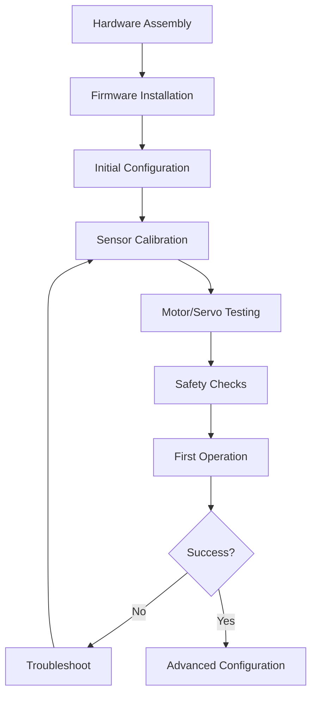

# Setup & Configuration Guide

Comprehensive setup procedures for unmanned vehicle systems, from initial hardware assembly to flight-ready configuration.

## Quick Navigation

### By Platform Type
- **[UAV Setup](../uav-systems/)**: Multirotor and fixed-wing configuration
- **[UGV Setup](../ugv-systems/)**: Ground vehicle setup procedures
- **[Flight Controllers](../uav-systems/flight-controllers/)**: ArduPilot, Betaflight, INAV, CleanFlight
- **[Arduino Systems](../ugv-systems/control-platforms/arduino-systems.md)**: Microcontroller setup
- **[Raspberry Pi Systems](../ugv-systems/control-platforms/raspberry-pi-systems.md)**: Linux-based platforms

### By Setup Stage
1. **[Hardware Assembly](#hardware-assembly)**: Physical construction and wiring
2. **[Firmware Installation](#firmware-installation)**: Loading flight controller firmware
3. **[Initial Configuration](#initial-configuration)**: Basic parameter setup
4. **[Calibration](#calibration-procedures)**: Sensors and control surfaces
5. **[Testing & Validation](#testing-and-validation)**: Pre-flight checks
6. **[Flight/Operation](#first-operation)**: Initial operation procedures

## General Setup Workflow

## Hardware Assembly

### Pre-Assembly Checklist

- [ ] All components received and verified
- [ ] Tools gathered (soldering iron, hex drivers, multimeter)
- [ ] Workspace organized and well-lit
- [ ] Documentation/build guide available
- [ ] Safety equipment ready (glasses, ventilation)

### Assembly Best Practices

**Organization**:
- Lay out all parts before starting
- Group components by system (power, control, sensors)
- Use small containers for hardware (screws, connectors)

**Wiring**:
- Plan wire routing before soldering
- Use appropriate wire gauge for current
- Keep power and signal wires separated
- Label wires (masking tape and marker)
- Allow slack for vibration/movement

**Soldering**:
- Clean tips frequently
- Use adequate flux
- Inspect for cold joints (shiny, firm = good)
- Check for shorts with multimeter
- Secure wires with heat shrink or zip ties

**Mechanical**:
- Tighten screws in X-pattern (prevents warping)
- Use threadlocker on vibration-prone fasteners
- Don't over-tighten (strip risk, especially plastic/carbon)
- Verify motor/prop clearances

## Firmware Installation

### UAV Platforms

**ArduPilot** (Pixhawk, Matek, etc.):
1. Download [Mission Planner](https://ardupilot.org/planner/) or [QGroundControl](http://qgroundcontrol.com/)
2. Connect FC via USB
3. Install Firmware → Select vehicle type (Copter, Plane, Rover)
4. See: [ArduPilot Setup Guide](../uav-systems/flight-controllers/ardupilot.md)

**Betaflight/INAV/CleanFlight**:
1. Download appropriate Configurator
2. Flash firmware for FC model
3. Follow setup wizard
4. See: [Betaflight](../uav-systems/flight-controllers/betaflight.md) | [INAV](../uav-systems/flight-controllers/inav.md) | [CleanFlight](../uav-systems/flight-controllers/cleanflight.md)

### UGV Platforms

**Arduino**:
1. Install [Arduino IDE](https://www.arduino.cc/en/software)
2. Select board and port
3. Upload code from [Arduino Examples](../../code/arduino/)
4. See: [Arduino Programming Guide](../programming/arduino-programming/)

**Raspberry Pi**:
1. Flash [Raspberry Pi OS](https://www.raspberrypi.org/software/) to SD card
2. Boot and configure (SSH, WiFi, etc.)
3. Install required libraries
4. See: [Raspberry Pi Programming Guide](../programming/raspberry-pi-programming/)

## Initial Configuration

### UAV Configuration Steps

1. **Frame Type Selection**: Match vehicle configuration
2. **Receiver Setup**: Bind transmitter, map channels
3. **Motor Configuration**: Order, direction, ESC protocol
4. **Flight Modes**: Assign modes to switches
5. **Failsafe**: Configure emergency behavior

### UGV Configuration Steps

1. **Motor Driver Setup**: Verify connections
2. **Sensor Integration**: Test sensors individually
3. **Control Logic**: Upload and test control code
4. **Safety Features**: Emergency stop, limits

## Calibration Procedures

### Critical Calibrations (UAV)

**Accelerometer** (ESSENTIAL):
- Purpose: Determines level orientation
- Procedure: Place on level surface, follow 6-orientation prompts
- Frequency: After build, after crashes, if drifting

**Compass** (ESSENTIAL for GPS modes):
- Purpose: Determines heading
- Procedure: Outdoor rotation in all axes, away from metal/electronics
- Frequency: After build, when moving locations (different magnetic fields)

**Radio** (ESSENTIAL):
- Purpose: Maps transmitter to FC
- Procedure: Move all sticks/switches to extremes
- Frequency: After receiver change, if channels mismapped

**ESC Calibration** (Usually optional):
- Purpose: Set throttle range
- Procedure: Full throttle → connect battery → lower throttle
- Frequency: After ESC change, if throttle range incorrect

### UGV Calibrations

**Motor Direction**:
- Verify correct forward/reverse/turn directions
- Adjust in code or swap wires

**Sensor Calibration**:
- Ultrasonic: Verify readings with ruler
- IMU: Level calibration if used
- GPS: Outdoor lock test (if equipped)

## Testing and Validation

### Pre-Flight Checks (UAV)

!!! danger "Props OFF for all ground testing except final pre-flight!"

**Motor Test** (Props OFF):
- [ ] All motors spin correct direction
- [ ] Motor order matches frame
- [ ] No unusual sounds/vibrations
- [ ] ESCs not overheating

**Control Surface Test** (Fixed-Wing):
- [ ] Ailerons respond correctly to roll input
- [ ] Elevator responds correctly to pitch input
- [ ] Rudder responds correctly to yaw input
- [ ] Servos reach full deflection without binding

**Sensor Verification**:
- [ ] GPS lock (10+ satellites, HDOP <2.0)
- [ ] Compass heading matches reality (compare to phone compass)
- [ ] Battery voltage reads correctly
- [ ] Barometer altitude reasonable

**Failsafe Test**:
- [ ] Arm vehicle (props off)
- [ ] Turn off transmitter
- [ ] Verify failsafe activates (motors stop or RTL behavior)

### Ground Test (UGV)

**On Blocks** (wheels off ground):
- [ ] Motors spin correct direction
- [ ] Speed control works
- [ ] Steering/turning functions
- [ ] Sensors read correctly
- [ ] Emergency stop works

**Tethered Test**:
- [ ] Place on ground, tethered or in confined space
- [ ] Test basic movements (forward, back, turn)
- [ ] Verify autonomous behavior (if applicable)
- [ ] Check for unexpected behavior

## First Operation

### UAV First Flight

**Environment**:
- Open area, no obstacles (50m × 50m minimum)
- Grass surface (softer landings)
- Wind <10mph for beginners
- No people/animals nearby

**Procedure**:
1. Final pre-flight check (with props ON)
2. Place vehicle on level surface
3. Power on transmitter, then vehicle
4. Wait for GPS lock (if GPS modes planned)
5. Stand back 5+ meters
6. ARM vehicle
7. Slowly increase throttle
8. Hover at 1-2m altitude
9. Test basic controls (roll, pitch, yaw)
10. Land gently
11. DISARM

**If Problems**:
- Immediate flip on takeoff → Motor order/direction wrong (land immediately, fix)
- Strong drift → Compass/accelerometer calibration issue
- Won't arm → Check pre-arm errors in ground station

### UGV First Operation

**Procedure**:
1. Open area or designated test course
2. Power on
3. Start with manual control (if available)
4. Test all movement directions
5. Verify sensors working (obstacle avoidance, line following, etc.)
6. Test autonomous behavior (if applicable)
7. Emergency stop test

## Post-Setup Optimization

### Tuning

**UAV PID Tuning**:
- Start with defaults
- Fly, observe behavior (oscillations = too high, sluggish = too low)
- Adjust incrementally (10% changes)
- See platform-specific guides for details

**UGV Tuning**:
- Motor speed optimization
- Sensor threshold adjustment
- PID tuning (if implementing closed-loop control)

### Logging & Analysis

**Enable Logging**:
- UAV: BlackBox (Betaflight/INAV) or DataFlash (ArduPilot)
- UGV: Serial logging or SD card

**Analyze Logs**:
- Check for errors, warnings
- Verify sensor performance
- Identify issues for tuning

## Common Setup Issues

### Power Issues
**Symptom**: Electronics don't power on or brownout
**Causes**: Low battery, poor connections, insufficient BEC
**Solutions**: Check voltage, verify all connections, upgrade BEC if needed

### Motor Issues
**Symptom**: Motors don't spin or spin wrong direction
**Causes**: Bad connections, wrong configuration, defective ESC
**Solutions**: Check wiring, verify config, test ESCs individually

### Sensor Issues
**Symptom**: GPS no lock, compass errors, incorrect readings
**Causes**: Poor placement, interference, not calibrated
**Solutions**: Relocate sensors, calibrate properly, shield from noise

### Communication Issues
**Symptom**: Can't connect to vehicle, lost packets
**Causes**: Wrong baud rate, poor connection, interference
**Solutions**: Verify settings, check cables, test different ports

## Safety Guidelines

### Electrical Safety
- Always disconnect battery when not operating
- Check polarity before connecting power
- Use fuses or current-limited supplies when testing
- Keep water away from electronics

### Mechanical Safety
- Propellers/wheels off for initial testing
- Secure all components (vibration loosens screws)
- Inspect for damage after crashes
- Replace damaged parts immediately

### Operational Safety
- Follow [Safety & Compliance Guide](../safety-compliance/)
- Have emergency stop always accessible
- Maintain visual line of sight
- Respect local regulations

## Resources

### Setup Tools
- Multimeter (voltage, continuity checking)
- Soldering station (temperature controlled)
- Hex driver set (1.5mm, 2.0mm, 2.5mm common)
- Cable tester (verify continuity)
- Prop balancer (reduce vibration)

### Software Tools
- Mission Planner / QGroundControl (UAV)
- Betaflight/INAV/CleanFlight Configurators
- Arduino IDE / PlatformIO
- BlackBox Explorer (log analysis)

### Documentation
- [UAV Build Guides](../uav-systems/build-guides/)
- [UGV Build Guides](../ugv-systems/build-guides/)
- [Programming Guides](../programming/)
- [Troubleshooting Guide](../troubleshooting/)

---

**Next Steps**: Choose your platform and follow the appropriate build guide to begin setup.
