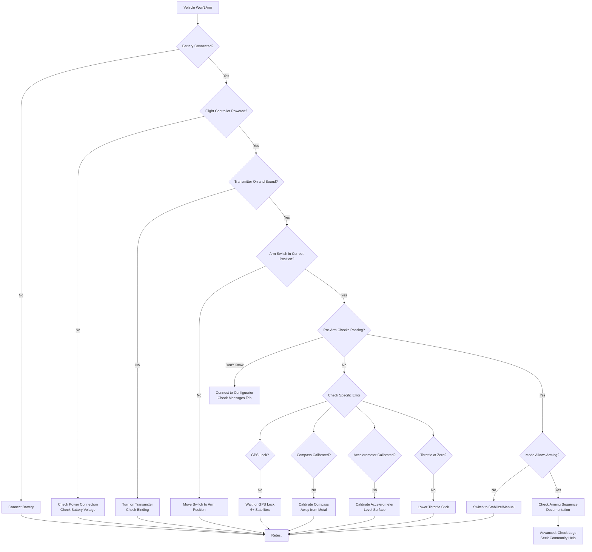
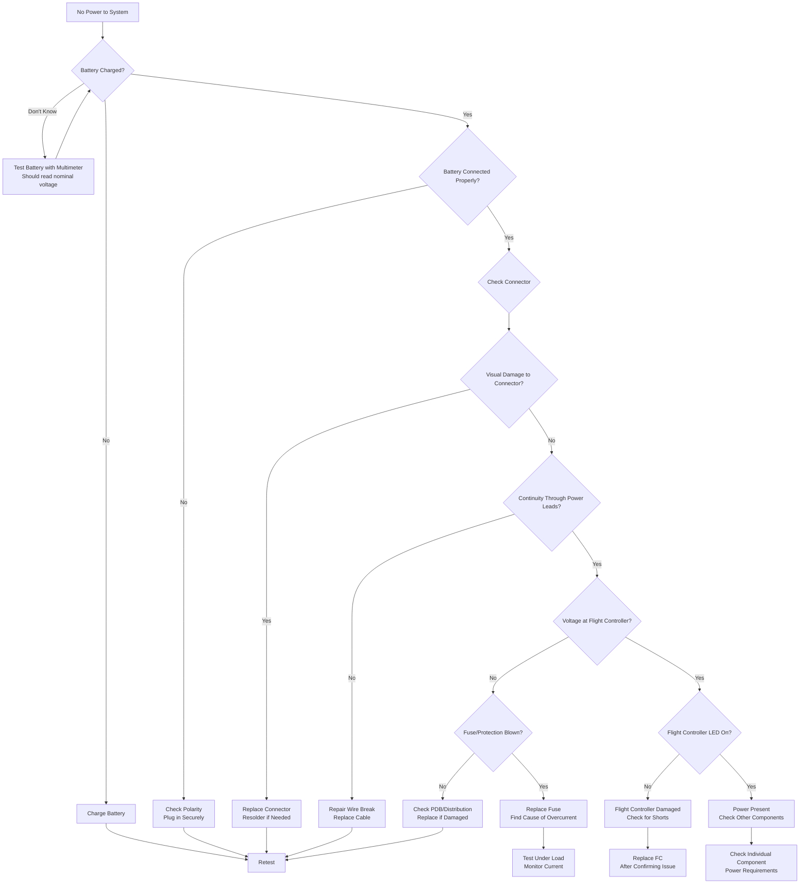
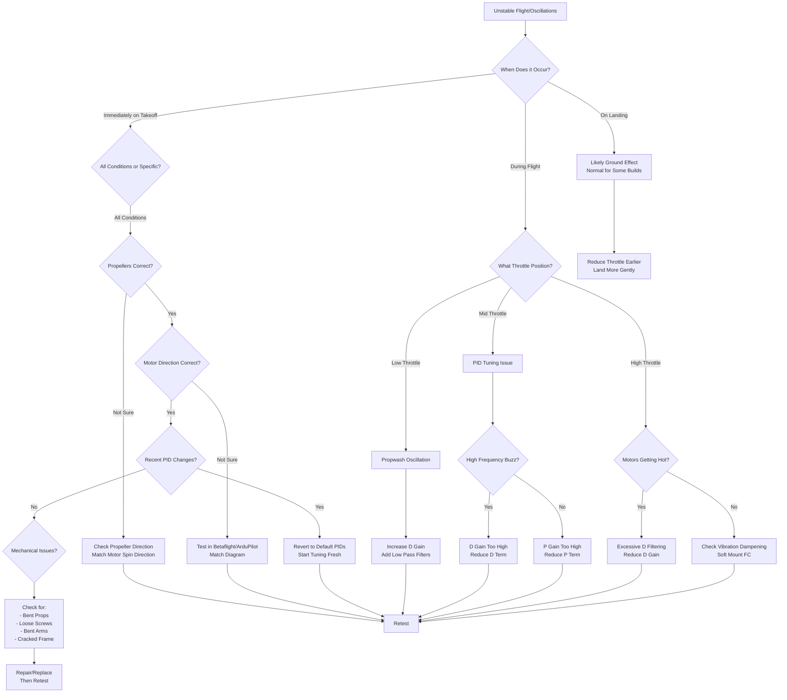
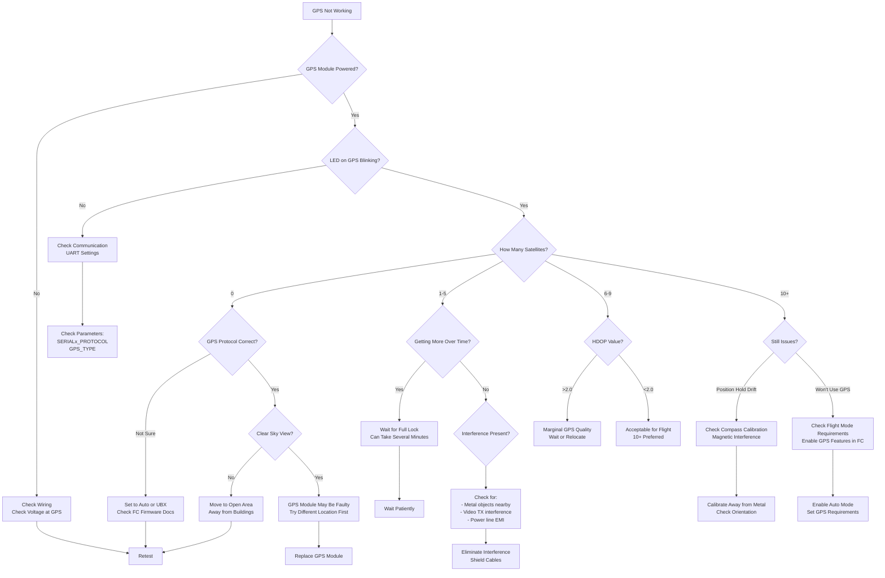
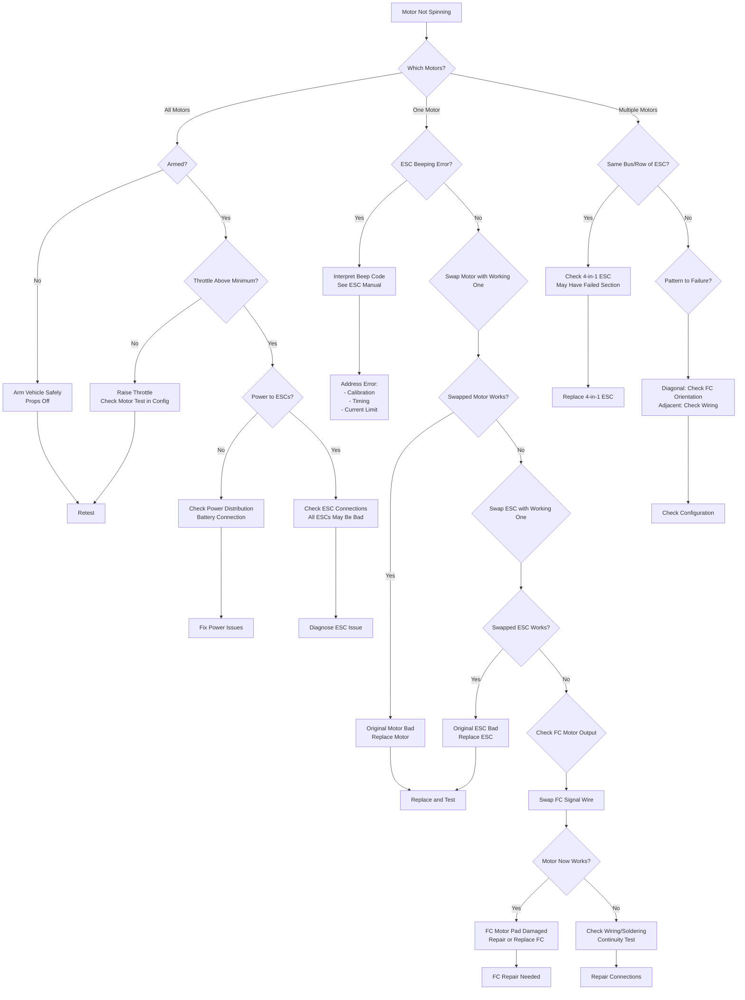
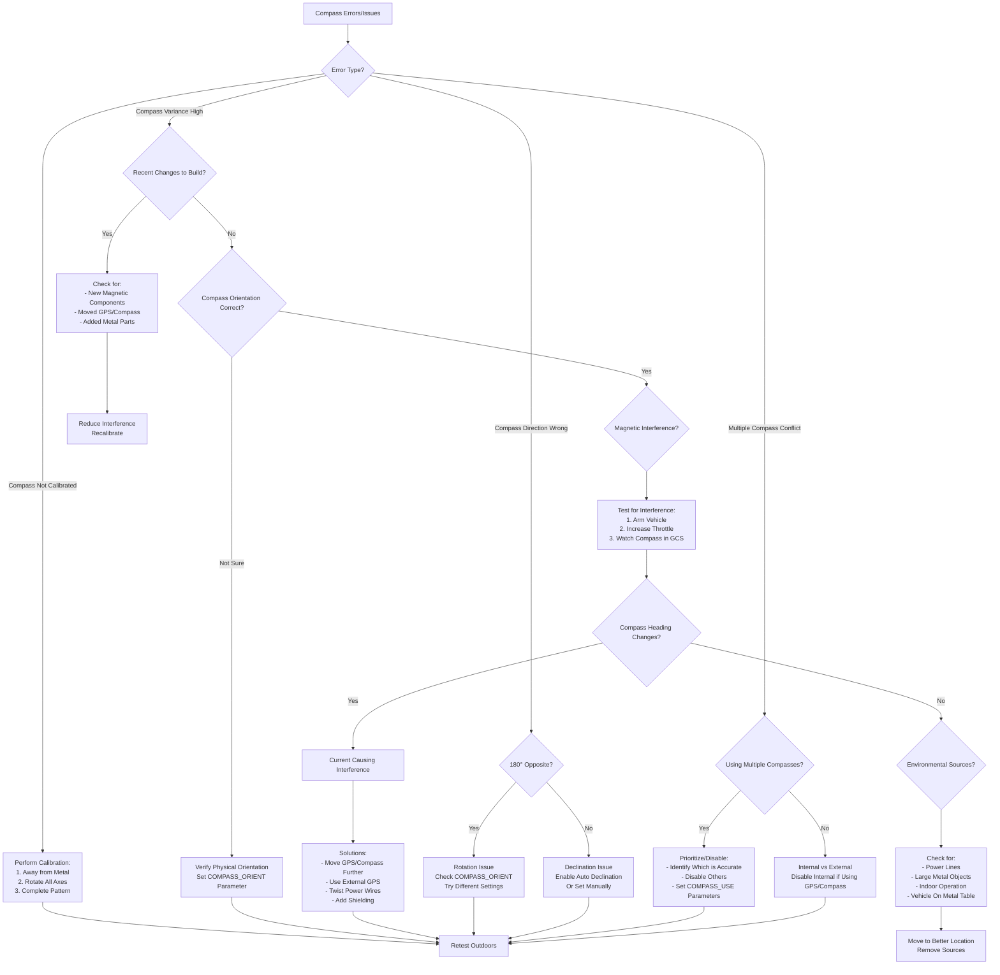
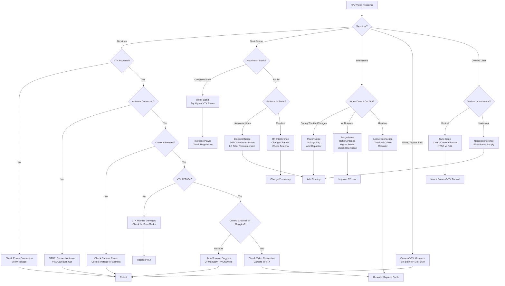

# Diagnostic Flowcharts

Visual decision trees to guide systematic troubleshooting of common issues. Follow the flow from symptoms to solutions.

## How to Use These Flowcharts

1. **Start at the top** with your symptom
2. **Answer questions** honestly at each decision point
3. **Follow the arrows** based on your answers
4. **Perform tests** as indicated
5. **Document your path** through the flowchart
6. **If solution doesn't work**, backtrack and try alternative paths

## Vehicle Won't Arm

## No Power to System

## Unstable Flight / Oscillations

## GPS Issues

## Communication/Connection Issues

```mermaid
graph TD
    A[Can't Connect to Flight Controller] --> B{Using USB?}
    B -->|Yes| C{Computer Detects Device?}
    B -->|No| D[Using Wireless/Telemetry]

    C -->|No| E{Tried Different Cable?}
    E -->|No| F[Try Different USB Cable<br/>Data cables not just power]
    E -->|Yes| G{Tried Different USB Port?}

    G -->|No| H[Try Different Port<br/>USB 2.0 Sometimes Better]
    G -->|Yes| I{Driver Installed?}

    I -->|No| J[Install CP210x or FTDI Driver<br/>Check FC Chip Type]
    I -->|Yes| K{FC Powered Separately?}

    K -->|No| L[May Need External Power<br/>Some FCs Don't Power via USB Alone]
    K -->|Yes| M[FC Hardware Issue<br/>Check for Physical Damage]

    C -->|Yes| N{Correct COM Port Selected?}
    N -->|No| O[Select Correct Port<br/>Disconnect Others to Verify]
    N -->|Yes| P{Correct Baud Rate?}

    P -->|No| Q[Try 115200<br/>Then 57600]
    P -->|Yes| R{Boot Button Needed?}

    R -->|Maybe| S[Some FCs Need Boot Button<br/>Hold While Connecting]
    R -->|No| T[Check Firmware Compatible<br/>Reflash if Needed]

    D --> U{Radio Link Quality?}
    U -->|Weak/None| V[Check:<br/>- Antenna Connected<br/>- Power to Radio<br/>- Correct Frequency<br/>- Range]

    U -->|Good| W{MAVLink/Protocol Settings?}
    W --> X[Verify:<br/>- SERIAL Protocol<br/>- Baud Rate Match<br/>- System ID<br/>- Ground Station Settings]

    F --> Y[Retest Connection]
    H --> Y
    J --> Y
    L --> Y
    M --> Z[Inspect/Replace FC]
    O --> Y
    Q --> Y
    S --> Y
    T --> Y
    V --> AA[Fix Radio Issues<br/>See Telemetry Troubleshooting]
    X --> Y
```

## Motor Not Spinning

## Compass Errors

## Video Signal Issues (FPV)

## Using Flowcharts in Education

### Individual Learning
Students can work through flowcharts to develop diagnostic thinking:

1. Present problem scenario
2. Student follows flowchart
3. Document decision path
4. Perform indicated tests
5. Report findings

### Group Problem Solving
Use flowcharts for collaborative troubleshooting:

1. Team reviews symptom together
2. Assign roles (reader, tester, documenter)
3. Work through flowchart as team
4. Discuss why each path was taken
5. Present solution to class

### Creating Custom Flowcharts
Advanced activity:

1. Identify common issue in your builds
2. Research troubleshooting steps
3. Create flowchart using Mermaid
4. Test with real problems
5. Refine based on results
6. Share with community

## Flowchart Symbols

Understanding the decision tree elements:

- **Rectangle**: Action to perform
- **Diamond**: Decision point / question
- **Arrow**: Flow direction
- **Terminal (rounded)**: Start or end point

## Advanced Troubleshooting

When flowcharts don't resolve the issue:

### Check Logs
Review detailed flight logs for patterns and anomalies.
[→ Log Analysis Guide](log-analysis.md)

### Component Isolation
Systematically isolate and test individual components:

1. Remove all unnecessary components
2. Test with minimal configuration
3. Add components back one at a time
4. Identify problematic component

### Voltage/Current Testing
Use multimeter to verify power delivery:

- Measure at source (battery)
- Measure at distribution (PDB)
- Measure at component
- Compare to specifications

### Waveform Analysis
For advanced users with oscilloscope:

- Check signal quality
- Identify noise sources
- Verify timing
- Analyze communication protocols

## Preventive Measures

Avoid many issues by following best practices:

- **Pre-flight Checks**: Catch problems before flight
- **Regular Inspection**: Scheduled maintenance
- **Proper Soldering**: Reduce connection failures
- **Quality Components**: Fewer failures
- **Good Cable Management**: Prevent shorts and breaks
- **Documentation**: Track changes and configurations

[→ Preventive Maintenance Guide](preventive-maintenance.md)

## Next Steps

For issues not covered by flowcharts:

- [Hardware Issues](hardware-issues.md) - Detailed component troubleshooting
- [Software Issues](software-issues.md) - Configuration and firmware problems
- [Flight Operation Issues](flight-operation-issues.md) - Flying problems
- [Log Analysis](log-analysis.md) - Interpreting flight data

## Contributing Flowcharts

Help improve this resource:

1. Identify common issues not covered
2. Draft flowchart on paper
3. Create Mermaid diagram
4. Test with real scenarios
5. Submit pull request with:
   - Flowchart code
   - Description of problem
   - Testing results

## Additional Resources

- Mermaid Live Editor: Create and test flowcharts
- Community Forums: Search for similar issues
- Flight Controller Documentation: Specific error codes
- Component Datasheets: Specifications and testing procedures
