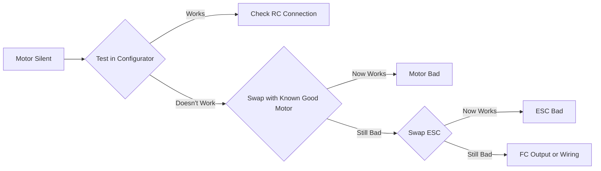

# Hardware Troubleshooting

Physical component problems categorized by symptom with solutions. Use this guide when experiencing hardware-related issues.

## Power Problems

### No Power to System

**Symptoms:**
- No LED lights
- No beeps from ESCs
- Multimeter shows no voltage

**Diagnostic Steps:**

1. **Check Battery**
   ```
   Test: Measure battery voltage
   Expected: Nominal voltage (11.1V for 3S, 14.8V for 4S, etc.)
   If low: Charge battery
   If zero: Battery dead, replace
   ```

2. **Inspect Connectors**
   - Visual check for burns, melting, damage
   - Verify polarity (red=positive, black=negative)
   - Ensure fully seated
   - Check for bent pins

3. **Test Continuity**
   ```
   Tool: Multimeter in continuity mode
   Test: Battery connector through to FC power pads
   Expected: Beep/low resistance (<1Ω)
   If open: Find and repair break
   ```

4. **Check Protection Devices**
   - Fuses: Visual inspection, continuity test
   - TVS diodes: May short when damaged
   - Replace if blown, investigate cause

### Intermittent Power

**Symptoms:**
- System reboots during flight
- Brown-outs under load
- Flickering LEDs

**Causes and Solutions:**

| Cause | Test | Solution |
|-------|------|----------|
| Loose Connection | Wiggle test while powered | Resolder joints, secure connectors |
| Voltage Sag | Monitor voltage under load | Larger battery, better wire gauge |
| Bad Solder Joint | Visual inspection, continuity | Resolder with proper technique |
| Failing Regulator | Measure 5V/3.3V rails | Replace FC or add external BEC |
| Connector Resistance | Voltage drop across connector | Use high-quality connectors, direct solder |

### Smoke/Burning Smell

!!! danger "Immediate Action Required"
    1. **Disconnect battery immediately**
    2. **Move to safe, ventilated area**
    3. **Do not reconnect power**
    4. **Identify damaged component**
    5. **Dispose of LiPo safely if battery damaged**

**Common Causes:**

1. **Reversed Polarity**
   - Damage: Instant, catastrophic
   - Prevention: Triple-check polarity, use keyed connectors
   - After: Replace all damaged components

2. **Short Circuit**
   - Signs: Wires melted, burn marks, discoloration
   - Find: Trace circuit, look for bridges
   - Repair: Remove short, replace damaged parts

3. **Overcurrent**
   - Damage: Melted insulation, burnt traces
   - Causes: Wrong component rating, motor stall
   - Prevention: Proper sizing, current limiting

4. **ESC Failure**
   - Often burns FETs (transistors)
   - Replace ESC
   - Check motor for shorts before replacing

## Motor Issues

### Motor Won't Spin

**Diagnostic Process:**



**Specific Scenarios:**

**All Motors:**
- Check arming
- Verify throttle input
- Test motor outputs in configurator
- Check ESC power

**One Motor:**
- Swap motor → If works, motor is bad
- Swap ESC → If works, ESC is bad
- Swap FC wire → If works, FC pad damaged
- Check all solder joints

**Multiple Motors:**
- Pattern important (diagonal, adjacent, random)
- Check for shared connection issues
- 4-in-1 ESC: May have failed section

### Motor Stuttering/Cogging

**Symptoms:**
- Jerky motion
- Won't spin smoothly
- Beeping and twitching

**Causes:**

1. **Timing Too Aggressive**
   - BLHeli setting
   - Try medium or low timing
   - Affects efficiency and smoothness

2. **Motor Bearing Damage**
   - Gritty feeling when turned by hand
   - Replace bearings or motor
   - Prevention: Avoid crashes into dirt

3. **Magnetic Damage**
   - Demagnetized after overheating
   - Replace motor
   - Prevention: Avoid sustained high current

4. **ESC Calibration**
   - Calibrate ESC endpoints
   - Verify protocol (PWM, OneShot, DShot)
   - Ensure proper firmware

5. **Loose Bell**
   - Check retaining screw
   - Tighten carefully
   - Use threadlocker

### Motors Running Hot

**Acceptable Temperature:**
- Warm (40-60°C): Normal
- Hot (60-80°C): Acceptable under load
- Very hot (80°C+): Problem

**Causes:**

| Cause | Check | Solution |
|-------|-------|----------|
| Props Too Large | Compare to specs | Use recommended size |
| D Gain Too High | Review PIDs | Reduce D term |
| Motor KV Wrong | Calculate | Match to voltage/prop |
| Mechanical Drag | Spin by hand | Fix binding, replace bearings |
| Electrical Issue | Check resistance | Replace motor if shorted |
| Sustained High Throttle | Flight style | Larger motors/props, fly differently |

## ESC Issues

### ESC Not Initializing (No Beeps)

**Normal Startup Sequence:**
1. Power on
2. Initialization beeps (1-3 beeps)
3. Battery cell count beep (2 beeps for 2S, 3 for 3S, etc.)
4. Ready tone

**If Silent:**

1. **No Power to ESC**
   - Check voltage at ESC pads
   - Verify polarity
   - Test power distribution

2. **ESC Firmware Corrupted**
   - Reflash BLHeli firmware
   - Use BLHeliSuite or BLHeli Configurator
   - Connect via FC passthrough or direct

3. **ESC Hardware Failure**
   - Test with known good motor
   - Swap with working ESC
   - Replace if confirmed bad

### Desync (Motor Cuts Out Briefly)

**Symptoms:**
- Motor stops mid-flight momentarily
- Causes loss of control
- May hear odd beeping

**Causes and Fixes:**

1. **Timing Too High**
   - Lower timing in BLHeli (try medium)
   - Some motor/ESC combos sensitive

2. **Bad Solder Joint**
   - Reflow motor wire connections
   - ESC to motor connections critical

3. **Noise on Signal Line**
   - Use DShot protocol (more robust)
   - Add capacitor on signal line
   - Shorter FC to ESC wiring

4. **Wrong PWM Frequency**
   - Match FC output to ESC capability
   - Typical: 480Hz PWM, 2kHz-8kHz multishot, DShot

5. **Low Voltage**
   - Check voltage sag under load
   - Larger battery or reduce prop size

### ESC Beeping Continuously

**Beep Patterns:**

- **Continuous beeping**: No signal from FC
  - Check wiring
  - Verify FC is outputting signal
  - Check protocol settings match

- **Fast beeping**: Low voltage or throttle calibration
  - Calibrate ESC endpoints
  - Check battery voltage

- **Alternating tones**: Motor connection issue
  - One motor wire loose or broken
  - Resolder connections

## GPS Issues

### No GPS Lock

**Expected Acquisition Time:**
- Cold start (no almanac): 30-60 seconds
- Warm start (recent almanac): 15-30 seconds
- Hot start (recent lock): 5-15 seconds

**Troubleshooting Steps:**

1. **Check GPS Module Power**
   ```
   Test: Measure voltage at GPS module
   Expected: 3.3V or 5V (depending on module)
   Check: LED on GPS should blink
   ```

2. **Verify UART Configuration**
   ```
   ArduPilot:
   - SERIALx_PROTOCOL = 5 (GPS)
   - GPS_TYPE = 1 (Auto) or specific type

   Betaflight/INAV:
   - GPS UART configured
   - GPS protocol set (UBLOX, NMEA, etc.)
   ```

3. **Check Antenna**
   - Ceramic patch antenna facing sky
   - Not blocked by carbon fiber (conductive)
   - Maintain clear view of horizon

4. **Environment**
   - Outdoor operation required
   - Away from buildings, trees
   - Not in urban canyon
   - Not during magnetic storm

5. **Wait Patiently**
   - First lock can take 5+ minutes
   - More satellites = better lock
   - HDOP should decrease over time

### Poor GPS Accuracy

**Symptoms:**
- Position hold drifts
- Waypoint navigation imprecise
- HDOP > 2.0

**Improvements:**

| Issue | Solution |
|-------|----------|
| Too few satellites | Wait for more, ensure clear sky view |
| High HDOP | Indicates poor satellite geometry, wait or relocate |
| Multipath interference | Move away from reflective surfaces |
| Compass interference | Calibrate compass, check for magnetic sources |
| GPS module failing | Test with different GPS, replace if confirmed |

### GPS Position Jumps

**Symptoms:**
- Location suddenly shifts on map
- Returns to correct position
- Causes erratic autonomous behavior

**Causes:**

1. **RF Interference**
   - From video transmitter
   - From ESCs/motors
   - Solution: Shield GPS cable, use external GPS on mast

2. **Poor Signal Quality**
   - Fewer than 8 satellites
   - HDOP > 2.5
   - Solution: Delay flight until better conditions

3. **Compass Issues**
   - Magnetic interference
   - Poor calibration
   - Solution: Recalibrate, isolate from current-carrying wires

## FPV Video Issues

### No Video Feed

**Check in Order:**

1. **VTX Power**
   - LED on VTX should be lit
   - Measure voltage (typically 7-36V depending on VTX)
   - Check for burnt components

2. **Antenna**
   - **CRITICAL**: Never power VTX without antenna
   - Check connection is secure
   - Antenna not damaged
   - Correct polarization (RHCP/LHCP)

3. **Camera Power**
   - Measure voltage at camera
   - Correct voltage (5V, 12V, or variable)
   - LED/indicator on camera

4. **Video Connection**
   - Camera video wire to VTX video input
   - Check solder joints
   - Verify not reversed (video/ground)

5. **Channel Match**
   - VTX and goggles on same frequency
   - Use auto-scan on goggles
   - Manually verify channel

### Noisy/Static Video

**Types of Interference:**

**Electrical Noise (horizontal lines):**
- Cause: Power supply noise from ESCs/motors
- Solution:
  - Add capacitor (1000µF low ESR) on main power
  - LC filter for camera/VTX power
  - Separate video ground from motor ground

**RF Interference (random static):**
- Cause: Other transmitters, WiFi, electronics
- Solution:
  - Change channel
  - Increase VTX power
  - Better antenna placement
  - Shield video cables

**Multipathing (wavy pattern):**
- Cause: Signal reflecting off surfaces
- Solution:
  - Circular polarized antennas (both TX and RX)
  - Better antenna orientation
  - Different location

### Video Cuts Out at Range

**Typical Ranges:**
- 25mW: 100-300m
- 200mW: 500m-1km
- 600mW: 1-2km

**Improvements:**

1. **Antenna Upgrade**
   - Patch antenna on ground station
   - Higher gain on receiver
   - Ensure both RHCP or both LHCP

2. **VTX Power**
   - Increase if legal and safe
   - Check local regulations
   - Manage heat dissipation

3. **Antenna Placement**
   - Minimize blockage from frame
   - Keep VTX and RX antennas apart
   - Orient for best pattern

4. **Diversity Receiver**
   - Two receivers with different antennas
   - Automatically switches to better signal

## Sensor Issues

### IMU/Gyro Problems

**Symptoms:**
- Drift in stabilize mode
- Won't initialize
- Tilts to one side
- Erratic behavior

**Solutions:**

1. **Calibration**
   - Level surface required
   - Vehicle must be still
   - Away from vibration
   - Complete full procedure

2. **Vibration Isolation**
   - Soft mount flight controller
   - Balance propellers
   - Check for loose screws
   - Reduce motor vibration

3. **Temperature**
   - Some gyros drift when temperature changes
   - Allow warm-up before calibration
   - Some FCs have gyro heating

4. **Hardware Failure**
   - Test: Check raw gyro data in configurator
   - If erratic or zeros: Hardware issue
   - Replace flight controller

### Barometer Issues

**Symptoms:**
- Altitude hold unstable
- Reading incorrect altitude
- Won't initialize

**Causes:**

1. **Blocked Barometer**
   - Ensure vent hole not covered
   - Remove tape/glue over sensor
   - Keep away from prop wash

2. **Conformal Coating**
   - Some coatings seal barometer
   - Keep sensor area clear
   - Use foam to protect but not seal

3. **Temperature Effect**
   - Barometer sensitive to temperature
   - Shield from direct motor heat
   - Allow stabilization time

4. **Rapid Changes**
   - Normal in wind/turbulence
   - Combine with GPS for better altitude
   - Use rangefinder near ground

### Compass Interference

**Symptoms:**
- Compass variance error
- Heading changes with throttle
- Poor heading hold
- Won't calibrate

**Finding Interference:**

1. **Current-Induced**
   - Arm vehicle (props off)
   - Increase throttle
   - Watch compass heading in GCS
   - Should not change >5°

2. **Permanent Magnets**
   - Metal in frame
   - Speakers/buzzers
   - Motors (normal, but minimize)
   - Battery (some have magnets)

**Solutions:**

1. **Increase Separation**
   - Use GPS/compass module on mast
   - Further from power wires
   - External GPS works best

2. **Reduce Current Fields**
   - Twist power wires
   - Route away from compass
   - Shield with metal foil (grounded)

3. **Calibration**
   - Away from all metal
   - Outdoors preferred
   - Complete full 3D rotation
   - Verify with test flight

## Connection Problems

### Loose Connections

**High-Risk Areas:**
- Motor to ESC solder joints
- Battery connector
- Flight controller USB
- Receiver to FC
- Sensor cables

**Prevention:**
- Quality solder joints (shiny, concave fillet)
- Strain relief on wires
- Hot glue or zip ties for security
- Regular inspection

**Testing:**
- Gentle wiggle test
- Continuity check with multimeter
- Visual inspection for cracks

### Solder Joint Failures

**Good vs Bad Solder:**

| Good Joint | Bad Joint |
|------------|-----------|
| Shiny appearance | Dull/grainy |
| Concave fillet | Ball shape or incomplete |
| Wire firmly attached | Wire pulls out easily |
| Proper heat applied | Cold joint or overheated |

**Common Mistakes:**
- Insufficient heat
- Too much solder
- Dirty surfaces
- Wrong solder type (use rosin core)
- Movement during cooling

**Repair:**
1. Remove old solder with wick/pump
2. Clean with isopropyl alcohol
3. Apply fresh solder to pad and wire
4. Heat both until solder flows
5. Let cool without movement

## Mechanical Issues

### Bent Props

**Effects:**
- Vibration
- Loss of thrust
- Unstable flight
- Hot motors

**Detection:**
- Visual inspection
- Spin test (watch for wobble)
- Flight test (excessive vibration)

**Solution:**
- Replace immediately
- Don't try to straighten
- Balance new props

### Loose Screws

**Critical Locations:**
- Motor mounting screws
- Flight controller mounting
- Arms to frame
- Battery strap
- Payload mounts

**Prevention:**
- Threadlocker (blue/removable)
- Regular inspection
- Proper torque
- Nyloc nuts where appropriate

### Frame Damage

**Types:**
- Cracks in arms
- Broken standoffs
- Bent motor mounts
- Delaminated carbon

**Inspection:**
- Visual check after every crash
- Flex test (gentle)
- Look for white stress marks on carbon
- Check alignment of arms

**Temporary Repairs:**
- Electrical tape can hold minor cracks
- Zip ties for emergency
- Not safe for aggressive flying

**Permanent:**
- Replace damaged arms
- Full frame replacement if central plate damaged

## Component Testing

### Multimeter Usage

**Voltage Testing:**
```
Setting: DC Voltage (V⎓)
Black probe: Ground/negative
Red probe: Positive terminal
Reading: Should match expected voltage
```

**Continuity Testing:**
```
Setting: Continuity (🔊 symbol)
Probes: Touch both ends of connection
Sound: Beep indicates continuity
Resistance: Should be <1Ω for good connection
```

**Resistance Testing:**
```
Setting: Resistance (Ω)
Probes: Across component
Motor phase-to-phase: 0.1-1Ω typical
Coil resistances should be equal
```

### Component Swapping

**Systematic Approach:**

1. **Identify Problem Component Area**
   - Motor, ESC, FC, wiring?

2. **Swap with Known Good**
   - Change one component
   - Test immediately
   - Document result

3. **Confirm Diagnosis**
   - If fixed: Faulty component identified
   - If not: Try next component
   - Sometimes multiple issues

4. **Replace Confirmed Bad Part**

### Bench Testing

**Safe Testing Without Props:**

1. **Remove propellers**
2. **Secure vehicle**
3. **Connect to configurator**
4. **Test motor outputs**
5. **Check sensors**
6. **Verify control inputs**

## Tools and Equipment

### Essential Tools

- **Multimeter**: Voltage, continuity, resistance
- **Soldering Iron**: 60W minimum, temperature controlled
- **Solder**: 60/40 or 63/37 rosin core
- **Wire Strippers**: Multiple gauges
- **Hex Drivers**: 1.5mm, 2.0mm, 2.5mm common
- **Tweezers**: ESD-safe
- **Flush Cutters**: Clean wire cuts

### Advanced Tools

- **Oscilloscope**: Signal analysis
- **Smoke Stopper**: Current limiter for first power-up
- **Helping Hands**: Hold parts during soldering
- **Heat Shrink**: Insulation and protection
- **LiPo Voltage Checker**: Quick battery test
- **Solder Wick/Pump**: Remove bad solder

## Preventive Measures

**After Every Flight:**
- Visual inspection
- Check for loose screws
- Look for damage
- Clean debris

**Weekly:**
- Detailed inspection
- Tighten all screws
- Check solder joints
- Test all functions

**Monthly:**
- Deep clean
- Re-apply threadlocker if needed
- Replace worn props
- Update firmware if needed

**After Crashes:**
- Full inspection before next flight
- Check frame for cracks
- Verify motor alignment
- Test all systems

[→ Preventive Maintenance Guide](preventive-maintenance.md)

## Next Steps

- [Software Issues](software-issues.md) - Configuration problems
- [Flight Operation Issues](flight-operation-issues.md) - Flying problems
- [Log Analysis](log-analysis.md) - Understanding flight data
- [Diagnostic Flowcharts](diagnostic-flowcharts.md) - Visual troubleshooting

## Safety Reminders

!!! danger "Safety First"
    - Always disconnect battery when working on electronics
    - Remove props for bench testing
    - Double-check polarity before connecting power
    - Use smoke stopper for first power-up after repairs
    - Wear safety glasses when testing with props
    - Never connect USB and battery power simultaneously unless confirmed safe by FC documentation
