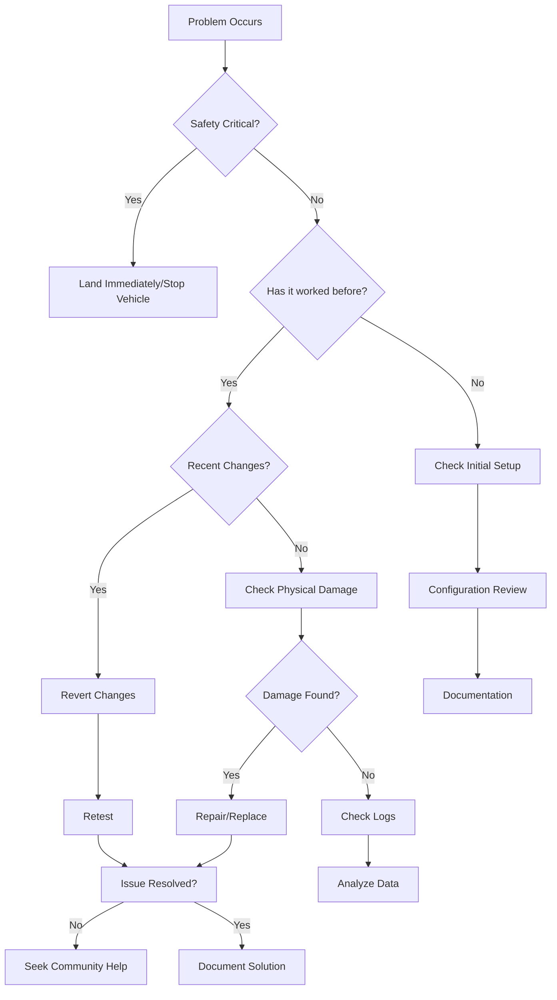

# Troubleshooting Guide

This comprehensive troubleshooting guide helps diagnose and resolve common issues with unmanned vehicle systems. Use the diagnostic framework and flowcharts to systematically identify and fix problems.

## Quick Diagnostic Framework

When encountering an issue, follow this systematic approach:

## Troubleshooting Categories

### Hardware Issues
Physical problems with components, connections, or mechanical systems.

**Common Symptoms:**
- Motor won't spin
- No power to system
- Smoke or burning smell
- Broken parts
- Loose connections

[→ Hardware Troubleshooting Guide](hardware-issues.md)

### Software Issues
Configuration, firmware, compilation, and parameter problems.

**Common Symptoms:**
- Won't compile/upload firmware
- Configuration won't save
- Features not working as expected
- Connection issues with configurator
- Parameter errors

[→ Software Troubleshooting Guide](software-issues.md)

### Flight Operation Issues
Problems during flight or vehicle operation.

**Common Symptoms:**
- Won't arm
- Unstable flight
- Drifting
- Unexpected behavior
- Crashes

[→ Flight Operation Troubleshooting](flight-operation-issues.md)

### Diagnostic Flowcharts
Step-by-step decision trees for common problems.

**Includes:**
- Won't arm flowchart
- No power flowchart
- Unstable flight flowchart
- GPS issues flowchart
- Communication problems flowchart

[→ Diagnostic Flowcharts](diagnostic-flowcharts.md)

### Log Analysis
Interpreting flight logs to diagnose issues.

**Topics:**
- ArduPilot log analysis
- Betaflight blackbox
- Identifying issues in logs
- Log analysis tools

[→ Log Analysis Guide](log-analysis.md)

### Safety Incident Response
Handling crashes, flyaways, and safety incidents.

**Covers:**
- Immediate response procedures
- Incident documentation
- Root cause analysis
- Prevention strategies

[→ Safety Incident Response](safety-incident-response.md)

### Preventive Maintenance
Regular inspection and maintenance to prevent problems.

**Includes:**
- Pre-flight checklists
- Regular inspection schedules
- Component lifecycle tracking
- Maintenance records

[→ Preventive Maintenance Guide](preventive-maintenance.md)

## Problem-Solving Methodology

### 1. Define the Problem
Be specific about symptoms:

**Good:** "Motors 1 and 3 spin, but motors 2 and 4 don't respond in Betaflight motor test tab"

**Poor:** "Motors don't work"

### 2. Gather Information
- When did problem start?
- What changed recently?
- Does it happen consistently?
- What have you already tried?

### 3. Form Hypotheses
List possible causes from most to least likely:

1. Most recent change caused issue
2. Common failure mode for this symptom
3. Related systems that could affect this
4. Rare but possible causes

### 4. Test Systematically
- Test one variable at a time
- Document each test and result
- Start with easiest/safest tests
- Don't skip obvious checks

### 5. Document and Share
- Record what worked
- Share solutions with community
- Update this documentation
- Help others with same issue

## Essential Tools for Troubleshooting

### Hardware Tools
- Multimeter (measure voltage, continuity)
- Soldering iron (repair connections)
- Hex drivers and screwdrivers
- Smoke stopper (current limiter for first power-up)
- USB cable (configuration and logs)

### Software Tools
- Flight controller configurator
- Log analysis software
- Ground control station
- Firmware flashing tools
- Parameter management tools

### Testing Equipment
- Spare components (motors, ESCs, props)
- Power supply or battery
- RC transmitter
- Computer with required software

## Common Mistakes to Avoid

### Rushing Diagnostics
**Problem:** Making changes without understanding cause

**Solution:** Follow systematic approach, test hypotheses

### Changing Multiple Things
**Problem:** Can't identify which change fixed issue

**Solution:** Change one variable at a time, retest

### Ignoring Documentation
**Problem:** Missing important configuration steps

**Solution:** Read manuals, follow build guides, check wiki

### Skipping Pre-Flight Checks
**Problem:** Flying with known or unknown issues

**Solution:** Complete full pre-flight checklist every time

### Not Checking Physical Issues
**Problem:** Spending hours on software for hardware problem

**Solution:** Always check connections, damage, basics first

## When to Seek Help

### Community Resources
- Forums (RCGroups, IntoPFPV, ArduPilot Discuss)
- Discord servers (Betaflight, INAV, ArduPilot)
- Facebook groups
- Reddit (r/multicopter, r/fpv, r/diydrones)

### What to Include When Asking for Help

1. **Detailed Problem Description**
   - Specific symptoms
   - When it occurs
   - Frequency and consistency

2. **System Information**
   - Flight controller model and firmware version
   - Other components (ESC, motors, etc.)
   - Build photos (if relevant)

3. **What You've Tried**
   - Tests performed
   - Results of each test
   - Changes made

4. **Logs and Screenshots**
   - Flight logs (if flight-related)
   - Configuration screenshots
   - Error messages

5. **Relevant History**
   - Was it working before?
   - Recent changes
   - Previous similar issues

!!! tip "Helping Others Help You"
    The more specific and complete your information, the faster and more accurate the help you'll receive. Vague questions get vague answers.

## Educational Troubleshooting Activities

### Activity 1: Fault Injection
**Objective:** Learn systematic diagnostics

**Procedure:**
1. Instructor introduces deliberate fault
2. Student uses diagnostic framework
3. Document troubleshooting process
4. Identify and fix issue
5. Explain root cause

**Possible Faults:**
- Reversed motor direction
- Unplugged sensor
- Wrong parameter value
- Loose connection

### Activity 2: Log Analysis Challenge
**Objective:** Interpret flight logs

**Procedure:**
1. Provide logs from problematic flights
2. Student identifies issues in data
3. Proposes solutions
4. Compares with actual solutions

### Activity 3: Build Peer Review
**Objective:** Catch issues before they cause problems

**Procedure:**
1. Students review each other's builds
2. Use inspection checklist
3. Identify potential issues
4. Provide constructive feedback
5. Verify corrections

## Emergency Procedures

### In-Flight Emergency
1. **Maintain Calm**: Clear thinking saves vehicles
2. **Switch to Stabilize**: Most predictable mode
3. **Land Immediately**: Find safest available spot
4. **Cut Power After Landing**: Disarm or disconnect battery
5. **Assess Damage**: Before moving or touching
6. **Document**: Photos, notes, logs

### Electrical Fire/Smoke
1. **Disconnect Power Immediately**: Pull battery
2. **Move to Safe Area**: Away from flammable materials
3. **Do Not Use Water**: Electrical fire hazard
4. **Use Fire Extinguisher if Needed**: CO2 or dry chemical
5. **Ventilate Area**: Smoke from burning electronics is toxic
6. **Dispose of Damaged Battery Safely**: See [Battery Safety](../safety-compliance/battery-safety.md)

### Lost Vehicle (Flyaway)
1. **Note Last Known Position and Direction**
2. **Check Logs**: May contain GPS coordinates
3. **Search Systematically**: Start from last seen location
4. **Use Beeper**: If installed and battery still connected
5. **Ask for Help**: Neighbors, local drone groups
6. **File Reports**: If required by local regulations

## Quick Reference Tables

### Voltage Check Points

| System | Normal Voltage | Low Voltage | Action |
|--------|---------------|-------------|---------|
| 1S LiPo | 3.7-4.2V | <3.5V | Charge/Replace |
| 2S LiPo | 7.4-8.4V | <7.0V | Charge/Replace |
| 3S LiPo | 11.1-12.6V | <10.5V | Charge/Replace |
| 4S LiPo | 14.8-16.8V | <14.0V | Charge/Replace |
| 5V Rail | 4.8-5.2V | <4.5V | Check regulator |
| 3.3V Rail | 3.2-3.4V | <3.0V | Check regulator |

### LED Indicator Meanings

Varies by flight controller, but common patterns:

| Pattern | Meaning | Action |
|---------|---------|--------|
| Solid Green | Armed, ready | Normal |
| Flashing Green | Disarmed, ready | Can arm |
| Flashing Red | Error/Warning | Check status |
| Fast Flashing Red | Critical Error | Check diagnostics |
| Blue Flashing | Booting/Initializing | Wait |
| Alternating Colors | Specific error code | Check manual |

## Troubleshooting by Symptom

Quick links to relevant sections:

- **No Power**: [Hardware Issues - Power Problems](hardware-issues.md#power-problems)
- **Won't Arm**: [Flight Operation Issues - Arming Problems](flight-operation-issues.md#arming-problems)
- **Motor Problems**: [Hardware Issues - Motor Problems](hardware-issues.md#motor-issues)
- **GPS Not Working**: [Hardware Issues - GPS Problems](hardware-issues.md#gps-issues)
- **Unstable Flight**: [Flight Operation Issues - Stability Problems](flight-operation-issues.md#stability-issues)
- **Video Issues**: [Hardware Issues - FPV Problems](hardware-issues.md#fpv-video-issues)
- **Won't Connect**: [Software Issues - Connection Problems](software-issues.md#connection-issues)
- **Firmware Problems**: [Software Issues - Firmware Issues](software-issues.md#firmware-problems)

## Advanced Diagnostics

### Multimeter Testing
Learn to use a multimeter for electrical diagnostics:

- **Voltage**: Measure power supply levels
- **Continuity**: Test for breaks in connections
- **Resistance**: Check component integrity

### Oscilloscope Analysis
For advanced users:

- Signal quality analysis
- Electrical noise identification
- Timing verification

### Component Testing
Isolate and test individual components:

- Swap with known good component
- Test in different system
- Use manufacturer test procedures

## Documentation and Record Keeping

Maintain logs for effective troubleshooting:

### Build Documentation
- Component list with purchase dates
- Configuration files backed up
- Photos at each build stage
- Parameter settings recorded

### Flight Logs
- Keep all flight logs
- Name files descriptively
- Note conditions and issues
- Organize by date

### Maintenance Records
- Inspection dates and findings
- Parts replaced and when
- Firmware versions
- Configuration changes

## Next Steps

Choose the appropriate troubleshooting guide for your issue:

- [Diagnostic Flowcharts](diagnostic-flowcharts.md) - Visual decision trees
- [Hardware Issues](hardware-issues.md) - Physical component problems
- [Software Issues](software-issues.md) - Configuration and firmware
- [Flight Operation Issues](flight-operation-issues.md) - Flying problems
- [Log Analysis](log-analysis.md) - Understanding flight data
- [Safety Incident Response](safety-incident-response.md) - Crash procedures
- [Preventive Maintenance](preventive-maintenance.md) - Avoid issues

## Additional Resources

- [Safety & Compliance](../safety-compliance/index.md)
- [Control Systems](../control-systems/index.md)
- [Community Resources](../references/community-resources.md)
